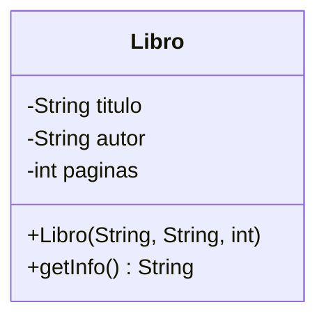
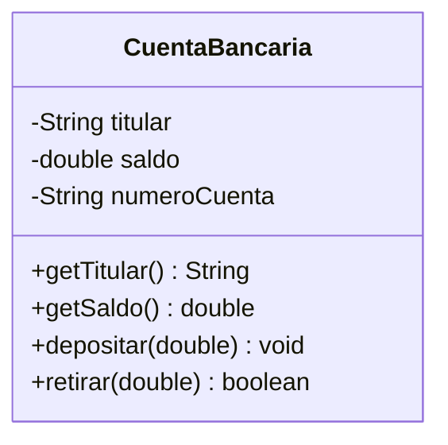
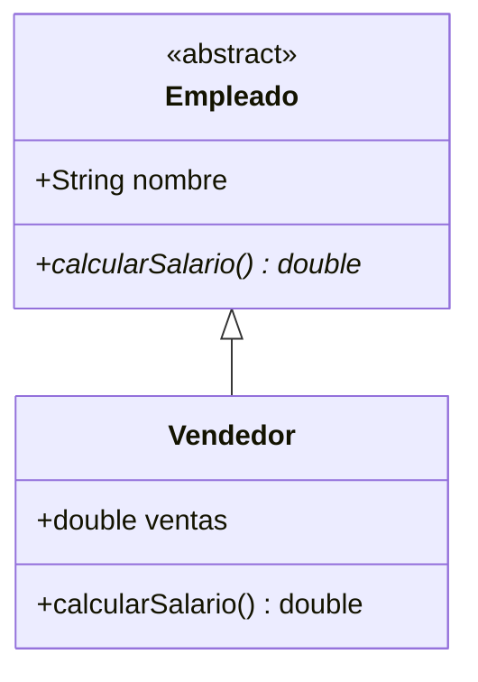

# **Guía de Java para Principiantes**

## **Introducción**
Bienvenido a la Guía de Java para Principiantes. Este documento tiene como objetivo proporcionar una introducción completa y clara a los conceptos fundamentales de Java. A lo largo de esta guía, exploraremos desde la sintaxis básica hasta temas más avanzados, como el manejo de excepciones y la programación orientada a objetos.

---

# 📘 E2T_Java
# Índice:

- [CAPÍTULO 1: BREVE HISTORIA Y FILOSOFIA DE JAVA](#capítulo-1-breve-historia-y-filosofia-de-java)
- [CAPÍTULO 2: CONFIGURACION DEL ENTORNO DE DESARROLLO JDK IDE Y LINEA DE COMANDOS](#capítulo-2-configuracion-del-entorno-de-desarrollo-jdk-ide-y-linea-de-comandos)
- [CAPÍTULO 3: ESTRUCTURA BASICA DE UN PROGRAMA DE JAVA](#capítulo-3-estructura-basica-de-un-programa-de-java)
- [CAPÍTULO 4: TIPOS DE DATOS Y VARIABLES](#capítulo-4-tipos-de-datos-y-variables)
- [CAPÍTULO 5: OPERADORES Y EXPRESIONES](#capítulo-5-operadores-y-expresiones)
- [CAPÍTULO 6: CONTROL DE FLUJO - IF ELSE SWITCH](#capítulo-6-control-de-flujo---if-else-switch)
- [CAPÍTULO 7: BUCLES - FOR WHILE DO-WHILE](#capitulo-7-bucles---for-while-do-while)
- [CAPÍTULO 8: METODOS - DEFINICION PARAMETROS Y RETORNO](#capítulo-8-metodos-definicion-parametros-y-retorno)
- [CAPÍTULO 9: MANEJO DE EXCEPCIONES - TRY CATCH FINALLY](#capítulo-9-manejo-de-excepciones---try-catch-finally)
- [CAPÍTULO 10: CLASES Y OBJETOS](#capítulo-10-clases-y-objetos)
- [CAPÍTULO 11: MODIFICADORES DE ACCESO Y ENCAPSULACIÓN](#capítulo-11-modificadores-de-acceso-y-encapsulación)
- [CAPÍTULO 12: HERENCIA Y POLIMORFISMO](#capítulo-12-herencia-y-polimorfismo)
- [CAPÍTULO 13: INTERFACES Y CLASES ABSTRACTAS](#capítulo-13-interfaces-y-clases-abstractas)
- [CAPÍTULO 14: COLECCIONES - ARRAYLIST HASHMAP Y HASHSET](#capítulo-14-colecciones---arraylist-hashmap-y-hashset)
- [CAPÍTULO 15: CLASES ANIDADAS Y ANÓNIMAS](#capítulo-15-clases-anidadas-y-anónimas)
- [CAPÍTULO 16: FLUJOS DE ENTRADA/SALIDA IO EN JAVA](#capítulo-16-flujos-de-entradasalida-io-en-java)
- [CAPÍTULO 17: LECTURA Y ESCRITURA DE ARCHIVOS DE TEXTO](#capítulo-17-lectura-y-escritura-de-archivos-de-texto)
- [CAPÍTULO 18: BUFFEREDREADER Y BUFFEREDWRITER PARA DATOS MASIVOS](#capítulo-18-bufferedreader-y-bufferedwriter-para-datos-masivos)
- [CAPÍTULO 19: MANEJO DE ARCHIVOS BINARIOS EN JAVA](#capítulo-19-manejo-de-archivos-binarios-en-java)
- [CAPÍTULO 20: SERIALIZACIÓN DE OBJETOS EN JAVA](#capítulo-20-serialización-de-objetos-en-java)
- [CAPÍTULO 21: INTRODUCCIÓN A NIO NEW IO EN JAVA](#capítulo-21-introducción-a-nio-new-io-en-java)


## CAPÍTULO 1: BREVE HISTORIA Y FILOSOFIA DE JAVA
---

### 🔹 1.1 Breve Historia de Java

A principios de los años 90, **Sun Microsystems** inició el *Green Project* liderado por **James Gosling**, con el objetivo de crear un lenguaje para dispositivos embebidos como decodificadores.

- El lenguaje inicial se llamó **Oak**, inspirado en un roble cercano a la oficina de Gosling.
- Oak fue diseñado para ser **simple, seguro y sin dependencia de hardware**.
- En 1993, con la explosión de la **World Wide Web**, se vio una nueva oportunidad: ejecutar programas desde el navegador.

En **1995**, Oak fue renombrado como **Java** (por problemas de copyright) y se lanzó junto al navegador **HotJava**.

> Java permitió ejecutar pequeños programas (applets) directamente en páginas web, ofreciendo interactividad sin descargar software adicional.

#### 🧩 “Write Once, Run Anywhere”

- **Java** se compila a **bytecode**, un formato intermedio.
- Este bytecode se ejecuta dentro de la **Máquina Virtual de Java (JVM)**.
- Un mismo programa puede correr en diferentes sistemas operativos **sin modificaciones**.

Esto redujo la complejidad del desarrollo multiplataforma y representó un **punto de inflexión en el desarrollo de software**.

---

### 🔹 1.2 La Filosofía de Java

Java fue diseñado con una **filosofía clara y pragmática**, basada en estos principios:

---

#### ✅ Simplicidad y Familiaridad
- Inspirado en **C y C++**, pero eliminando:
  - Herencia múltiple directa
  - Manejo explícito de punteros
- Resultado: un lenguaje más **fácil de aprender y mantener**.

---

#### 🌍 Portabilidad
- Gracias a la **JVM**, Java puede ejecutarse en cualquier sistema con una JVM compatible.
- Las empresas pueden desarrollar sin preocuparse por el hardware o sistema operativo.

---

#### 🔐 Seguridad
- Java se ejecuta **aislado del sistema operativo**.
- Protege contra código malicioso y garantiza seguridad, especialmente en los **applets**.

---

#### 🔁 Concurrencia y Multitarea
- Desde su inicio, Java incluye **soporte nativo para hilos**.
- Permite ejecutar múltiples tareas simultáneamente, facilitando el desarrollo de aplicaciones modernas.

---

#### 🛠️ Robustez y Manejo de Errores
- Elimina errores comunes como la segmentación de memoria (al evitar punteros).
- Sistema estructurado de **manejo de excepciones** para mayor estabilidad.

---

#### ⚡ Desempeño Razonable
- Aunque fue criticado por su lentitud inicial, Java ahora incluye **compilación Just-In-Time (JIT)**.
- Esto permite ejecutar código a velocidades cercanas al código nativo **sin perder portabilidad**.

---

### 🔹 1.3 Impacto y Evolución de Java

Desde 1995, Java se expandió en:

- Aplicaciones empresariales
- Navegadores
- Servidores
- Dispositivos móviles y embebidos
- Supercomputadoras

Con el tiempo, se añadieron nuevas características:
- **Genéricos**
- **Expresiones lambda**
- **APIs funcionales**

Java cuenta con una gran comunidad y un extenso ecosistema de:
- **Librerías**
- **Frameworks**
- **Herramientas de desarrollo**

> Hoy en día, Java sigue siendo uno de los lenguajes **más utilizados y valorados**, gracias a su enfoque en la **simplicidad, portabilidad y seguridad**.

---

## CAPÍTULO 2: CONFIGURACION DEL ENTORNO DE DESARROLLO (JDK, IDE Y LINEA DE COMANDOS)

### 🔧 Preparación del Entorno

Antes de programar en Java, es esencial preparar un entorno que permita **escribir, compilar y ejecutar** programas eficientemente. Este capítulo cubre:

- Instalación del **JDK**
- Elección de un **IDE**
- Uso de la **línea de comandos**
- Configuración de **variables de entorno**
- Consejos prácticos para un entorno óptimo

---

### ☕ 2.1 ¿Qué es el JDK y por qué es necesario?

El **Java Development Kit (JDK)** es un conjunto de herramientas y librerías esenciales para desarrollar en Java.

Incluye:
- `javac`: el compilador (código fuente → bytecode)
- `jdb`: depurador
- `jar`: herramienta para empaquetar archivos

> El **bytecode** generado se ejecuta en la **JVM** en cualquier sistema operativo.

---

### 📥 2.2 Descarga e Instalación del JDK

#### 📌 2.2.1 Identificación de la versión adecuada

- Oracle JDK
- OpenJDK
- Amazon Corretto
- AdoptOpenJDK

> Para aprender, la mejor opción suele ser la **última versión LTS** por su estabilidad y soporte.

---

#### ⚙️ 2.2.2 Proceso de instalación

##### 🪟 En Windows
1. Descarga desde [Oracle](https://www.oracle.com/java/technologies/javase-downloads.html) u [OpenJDK](https://openjdk.java.net).
2. Ejecuta el instalador (`.exe`).
3. Sigue el asistente de instalación y selecciona una ubicación, por ejemplo:  
   `C:\Program Files\Java\jdk-xx`

##### 🍎 En macOS
1. Descarga el archivo `.pkg`
2. Ejecuta el instalador.
3. El JDK se instalará en:  
   `/Library/Java/JavaVirtualMachines/`

##### 🐧 En Linux
- Opción 1: Instalar desde archivo `.tar.gz` y configurar variables.
- Opción 2: Usar gestor de paquetes:

```bash
sudo apt update
sudo apt install openjdk-11-jdk
```

---

### 🌐 2.3 Configuración de Variables de Entorno

#### 💻 En Windows
1. Abre *Panel de Control* → "Variables de entorno".
2. Edita la variable `Path`.
3. Agrega la ruta al bin del JDK, por ejemplo:  
   `C:\Program Files\Java\jdk-xx\bin`
4. Reinicia la terminal para aplicar los cambios.

#### 💻 En macOS / Linux
1. Edita tu archivo de configuración del shell (`~/.bashrc`, `~/.bash_profile`, `~/.zshrc`).

```bash
export JAVA_HOME=/ruta/a/jdk
export PATH=$JAVA_HOME/bin:$PATH
```

2. Aplica los cambios:

```bash
source ~/.bashrc
```

3. Verifica con:

```bash
java -version
javac -version
```

---

### 🧠 2.4 Elección e Instalación de un IDE

#### 🔍 Opciones Populares

| IDE         | Características principales                                     |
|-------------|----------------------------------------------------------------|
| **Eclipse** | Madurez, plugins variados, muy usado profesionalmente         |
| **IntelliJ**| Interfaz fluida, herramientas inteligentes, versión gratuita   |
| **NetBeans**| Fácil de usar, listo para Java desde el inicio                 |

#### 🛠️ Instalación

1. Descarga desde el sitio oficial (ej: [IntelliJ IDEA](https://www.jetbrains.com/idea/)).
2. Sigue el asistente de instalación.
3. Configura la ruta del JDK si no se detecta automáticamente.

---

### 🖥️ 2.5 Uso de Línea de Comandos

#### 🔃 Ciclo Básico

1. **Escribir el código**

```java
// HelloWorld.java
public class HelloWorld {
    public static void main(String[] args) {
        System.out.println("Hello, World!");
    }
}
```

2. **Compilar**

```bash
javac HelloWorld.java
```

3. **Ejecutar**

```bash
java HelloWorld
```

> Salida esperada:
> ```
> Hello, World!
> ```

---

#### 🛠️ Solución de Problemas Comunes

| Error                                      | Solución                                                  |
|-------------------------------------------|-----------------------------------------------------------|
| `java: command not found`                 | Verifica instalación y variables de entorno               |
| Error de clase no encontrada              | Asegúrate de compilar correctamente y ejecutar desde el directorio adecuado |
| Nombre del archivo no coincide con la clase pública | Asegúrate que el nombre del archivo sea el mismo que la clase pública (`HelloWorld.java`) |

---

### 💡 2.6 Consejos Finales para un Entorno Óptimo

- 🔁 **Mantén actualizado tu JDK**
- ⚙️ **Experimenta con distintos IDEs**
- 🧱 **Aprende comandos básicos**
- 📁 **Organiza tu código por carpetas:**
  - `/src` para código fuente
  - `/res` para recursos
  - `/config` para configuraciones

- ✅ **Flujo de trabajo recomendado:**
  1. Editar código
  2. Compilar
  3. Ejecutar
  4. Depurar

---

> Dominar esta configuración es el primer paso para convertirte en un desarrollador Java sólido y eficiente 🚀

---

## CAPÍTULO 3: ESTRUCTURA BASICA DE UN PROGRAMA DE JAVA
---

### 🧱 3.1 Elementos Fundamentales de un Programa Java

Un programa típico de Java incluye los siguientes elementos:

---

#### 1. `package`: Organización del código

```java
package com.cursojava.proyecto;
```

- Agrupa clases relacionadas.
- Opcional en programas simples.
- Recomendado para proyectos grandes.

---

#### 2. `import`: Inclusión de clases externas

```java
import java.util.Scanner;
```

- Permite el uso de clases de la API de Java o librerías externas.
- Evita escribir el nombre completo de las clases (como `java.util.Scanner`).

---

#### 3. Clase principal (`public class`)

```java
public class HolaMundo {
    // Código aquí
}
```

- Toda aplicación debe tener al menos una clase pública.
- El nombre de la clase **debe coincidir** con el nombre del archivo `.java`.

---

#### 4. Método `main`: Punto de entrada

```java
public static void main(String[] args) {
    // Instrucciones del programa
}
```

**Explicación de la firma:**
- `public`: accesible desde cualquier parte.
- `static`: se puede ejecutar sin instanciar la clase.
- `void`: no retorna valor.
- `String[] args`: recibe argumentos desde la línea de comandos.

---

#### 5. Instrucciones dentro del `main`

Aquí es donde se escribe el código que será ejecutado al correr el programa: imprimir mensajes, leer entradas, realizar cálculos, etc.

---

### 💻 3.2 Ejemplo Completo de Programa Básico

```java
// 1. Paquete opcional
package com.miempresa.proyecto;

// 2. Importaciones necesarias
import java.util.Scanner;

// 3. Clase principal
public class HolaMundo {

    // 4. Método main
    public static void main(String[] args) {

        // 5. Instrucciones
        System.out.println("Hola, Mundo!");

        // Leer entrada del usuario
        Scanner scanner = new Scanner(System.in);
        System.out.print("Introduce tu nombre: ");
        String nombre = scanner.nextLine();

        // Saludo personalizado
        System.out.println("Hola, " + nombre + ", ¡bienvenido a Java!");
    }
}
```

---

### 📝 3.3 Detalles Clave de la Estructura

#### ✅ Orden correcto:
1. `package`
2. `import`
3. Clase principal
4. Método `main`

#### 📂 Nombres correctos:
- El archivo debe llamarse **exactamente igual** que la clase pública.
  - Ej: `HolaMundo.java` → `public class HolaMundo`

#### ✍️ Convenciones:
- **Clases**: Mayúscula inicial, estilo *CamelCase* → `MiPrimeraClase`
- **Métodos y variables**: minúscula inicial, también *camelCase* → `mostrarMensaje`
- Usa nombres descriptivos para facilitar el mantenimiento del código.

#### 💬 Comentarios:
- Una línea: `// Comentario`
- Varias líneas:

```java
/*
Esto es un
comentario multilínea.
*/
```

---

### 🛠️ 3.4 Cómo Compilar y Ejecutar

#### 1. Compilar:

```bash
javac HolaMundo.java
```

> Esto crea el archivo `HolaMundo.class`.

#### 2. Ejecutar:

```bash
java HolaMundo
```

> Resultado en consola:
```
Hola, Mundo!
Introduce tu nombre: Juan
Hola, Juan, ¡bienvenido a Java!
```

---

### 🧾 3.5 Conclusión

Comprender la estructura básica de un programa Java te permite:

- Escribir código correctamente desde el inicio.
- Identificar errores comunes de compilación.
- Prepararte para aprender estructuras más complejas como clases auxiliares, métodos personalizados, lógica de control, etc.

> 🚀 *Dominar esta base es el primer paso hacia el desarrollo de aplicaciones Java robustas y profesionales.*

---

## CAPÍTULO 4: TIPOS DE DATOS Y VARIABLES

---

### 🧠 4.1 ¿Qué es una Variable?

Una **variable** es un espacio en memoria con un nombre único que se utiliza para almacenar datos. En Java, toda variable debe tener un **tipo de dato** que determine:

- Qué puede almacenar.
- Qué operaciones pueden realizarse sobre ella.

**Ejemplo:**

```java
int numero = 10;
```

- `int`: tipo de dato (entero).
- `numero`: nombre de la variable.
- `10`: valor almacenado.

---

### 📦 4.2 Tipos de Datos en Java

#### 4.2.1 Tipos de Datos Primitivos

Son los bloques básicos. No son objetos y se almacenan directamente:

| Categoría          | Tipo   | Tamaño  | Rango |
|-------------------|--------|---------|-------|
| Enteros           | `byte` | 8 bits  | -128 a 127 |
|                   | `short`| 16 bits | -32,768 a 32,767 |
|                   | `int`  | 32 bits | -2,147,483,648 a 2,147,483,647 |
|                   | `long` | 64 bits | -9,223,372,036,854,775,808 a 9,223,372,036,854,775,807 |
| Decimales         | `float`| 32 bits | ±1.4E-45 a ±3.4E38 |
|                   | `double`| 64 bits| ±4.9E-324 a ±1.7E308 |
| Caracteres        | `char` | 16 bits | '\u0000' a '\uffff' |
| Booleanos         | `boolean` | 1 bit (teórico) | `true` o `false` |

---

#### 4.2.2 Tipos de Datos por Referencia

Contienen **referencias a objetos**:

- **String** (cadenas de texto):
  ```java
  String mensaje = "Hola, mundo";
  ```
- **Arreglos**:
  ```java
  int[] numeros = {1, 2, 3, 4, 5};
  ```
- **Clases/Objetos personalizados**:
  Se declaran a partir de clases definidas por el usuario.

---

### 🛠️ 4.3 Declaración y Asignación de Variables

#### Declaración + Asignación en una sola línea:
```java
int edad = 30;
```

#### Declaración y asignación por separado:
```java
int edad;
edad = 30;
```

---

#### 4.3.1 Reglas de Nomenclatura

- Iniciar con letra, guion bajo (`_`) o signo de dólar (`$`).
- No usar palabras reservadas (`class`, `public`, `int`, etc.).
- Usar nombres descriptivos en **camelCase**:

```java
int contadorDeIntentos;
```

---

#### 4.3.2 Ejemplo con Varios Tipos

```java
int numeroEntero = 100;
double precio = 199.99;
boolean esActivo = true;
char inicial = 'A';
String mensaje = "Hola";
```

---

### 🧾 4.4 Inicialización y Valores por Defecto

| Tipo de Dato        | Valor por defecto |
|---------------------|-------------------|
| int, byte, short... | 0                 |
| float, double       | 0.0               |
| boolean             | false             |
| char                | '\u0000'          |
| String / referencias| null              |

> Las **variables locales** (dentro de métodos) deben ser inicializadas manualmente antes de usarse.

---

### 🔁 4.5 Conversión entre Tipos de Datos

#### 1. Conversión Implícita (ampliación):
```java
int numero = 100;
long numeroLargo = numero;
```

#### 2. Conversión Explícita (reducción):
```java
double valorDecimal = 9.99;
int valorEntero = (int) valorDecimal; // pierde la parte decimal
```

---

### ✅ 4.6 Buenas Prácticas con Variables

- **Usar nombres descriptivos**: en vez de `x`, usá `edad`, `totalVentas`, etc.
- **Inicializa siempre las variables locales**.
- **Elegir el tipo de dato más adecuado**: no uses `int` si `byte` alcanza.
- **Reducir el alcance**: declaralas en el bloque más pequeño posible.

---

## CAPÍTULO 5: Operadores y Expresiones

---

### ⚙️ 5.1 ¿Qué es un Operador?

Un **operador** es un símbolo que realiza una operación sobre uno o más valores llamados **operandos**.

**Ejemplo:**

```java
int resultado = 10 + 5; // resultado = 15
```

---

### 🧮 5.2 ¿Qué es una Expresión?

Una **expresión** combina operadores y operandos para producir un valor. Este valor puede ser de cualquier tipo: numérico, booleano o una cadena.

**Ejemplo:**

```java
int resultado = 10 + (5 * 2); // resultado = 20
```

---

### 🧩 5.3 Clasificación de Operadores en Java

#### 🔢 5.3.1 Operadores Aritméticos

Permiten realizar operaciones matemáticas básicas:

| Operador | Significado     |
|----------|-----------------|
| `+`      | Suma            |
| `-`      | Resta           |
| `*`      | Multiplicación  |
| `/`      | División        |
| `%`      | Módulo (resto)  |

**Ejemplo:**

```java
int a = 15, b = 4;
int suma = a + b;       // 19
int resta = a - b;      // 11
int producto = a * b;   // 60
int cociente = a / b;   // 3
int resto = a % b;      // 3
```

---

#### 💾 5.3.2 Operadores de Asignación

Asignan valores a variables. Pueden ser simples o combinados:

| Operador | Ejemplo       | Equivalente        |
|----------|---------------|--------------------|
| `=`      | `x = 10;`     | Asignación directa |
| `+=`     | `x += 5;`     | `x = x + 5;`       |
| `-=`     | `x -= 3;`     | `x = x - 3;`       |
| `*=`     | `x *= 2;`     | `x = x * 2;`       |
| `/=`     | `x /= 4;`     | `x = x / 4;`       |
| `%=`     | `x %= 3;`     | `x = x % 3;`       |

---

#### ⚖️ 5.3.3 Operadores de Comparación (Relacionales)

Comparan valores y devuelven `true` o `false`.

| Operador | Significado       |
|----------|-------------------|
| `==`     | Igual a           |
| `!=`     | Distinto de       |
| `>`      | Mayor que         |
| `<`      | Menor que         |
| `>=`     | Mayor o igual     |
| `<=`     | Menor o igual     |

**Ejemplo:**

```java
int a = 7, b = 5;
boolean esIgual = (a == b);   // false
boolean esMayor = (a > b);    // true
boolean esMenor = (a < b);    // false
```

---

#### 🔐 5.3.4 Operadores Lógicos

Trabajan con valores booleanos:

| Operador | Significado       |
|----------|-------------------|
| `&&`     | AND lógico        |
| `||`     | OR lógico         |
| `!`      | NOT lógico        |

**Ejemplo:**

```java
boolean cond1 = (5 > 3); // true
boolean cond2 = (10 < 20); // true

boolean resultado = cond1 && cond2;  // true
boolean resultado2 = cond1 || false; // true
boolean negacion = !cond1;           // false
```

---

#### 🔄 5.3.5 Operadores Unarios

Actúan sobre un solo operando:

| Operador | Ejemplo              | Resultado               |
|----------|----------------------|--------------------------|
| `+`      | `+a`                 | Valor positivo           |
| `-`      | `-a`                 | Inverso del valor        |
| `++`     | `a++` / `++a`        | Incrementa en 1          |
| `--`     | `a--` / `--a`        | Decrementa en 1          |
| `!`      | `!true`              | false                    |

**Ejemplo:**

```java
int c = 5;
c++; // c = 6
c--; // c = 5

boolean esVerdadero = true;
boolean esFalso = !esVerdadero; // false
```

---

#### 🧠 5.3.6 Operadores Bit a Bit

Trabajan a nivel binario:

| Operador | Descripción             |
|----------|--------------------------|
| `&`      | AND bit a bit            |
| `|`      | OR bit a bit             |
| `^`      | XOR bit a bit            |
| `~`      | Complemento              |
| `<<`     | Desplazamiento izq.      |
| `>>`     | Desplazamiento der.      |
| `>>>`    | Desplazamiento der. sin signo |

**Ejemplo:**

```java
int num1 = 5; // 0101
int num2 = 3; // 0011
int resultado = num1 & num2; // 0001 → 1
```

---

#### 🧮 5.3.7 Precedencia de Operadores

Java evalúa primero los operadores con mayor precedencia.

| Precedencia Alta → Baja |
|--------------------------|
| `()` Paréntesis          |
| `* / %`                  |
| `+ -`                    |
| Comparaciones (`< > ==`) |
| `&&`                     |
| `||`                     |
| Asignaciones (`=` `+=`)  |

**Ejemplo:**

```java
int resultado1 = 10 + 5 * 2;      // 20
int resultado2 = (10 + 5) * 2;    // 30
```

✅ **Consejo:** usá paréntesis para aclarar el orden y mejorar la legibilidad.

---

### 🧼 5.4 Buenas Prácticas con Operadores y Expresiones

- ✅ **Usá nombres descriptivos:**  
  En vez de `x + y`, mejor `precioProducto + impuesto`.

- ✅ **Dividí expresiones largas:**  
  Usá variables intermedias para simplificar y aclarar.

- ⚠️ **Cuidado con comparaciones de String:**  
  No uses `==`. En su lugar, usá `.equals()`:
  
  ```java
  String nombre = "Juan";
  if (nombre.equals("Juan")) {
      // correcto
  }
  ```

---
# CAPÍTULO 6: CONTROL DE FLUJO - IF, ELSE, SWITCH

## 📌 Introducción
El control de flujo permite dirigir la ejecución de un programa basado en condiciones. Estas estructuras son fundamentales para crear lógica dinámica en Java.

```java
// Ejemplo rápido:
if (usuarioEsPremium) {
    mostrarContenidoExclusivo();
} else {
    mostrarPublicidad();
}
```

---

## 6.1 ¿Qué es el Control de Flujo?
Mecanismo que determina **qué instrucciones** se ejecutan y en **qué orden**, basado en condiciones.

### 🔍 Analogía Práctica
> "Como un semáforo: si está en verde (true), el coche avanza; si está en rojo (false), se detiene."

---

## 6.2 Sentencia `if`
Evalúa una condición booleana para ejecutar un bloque de código.

### Estructura Básica
```java
if (condición) {
    // Código si la condición es true
}
```

### Ejemplo con Explicación Visual
```java
int temperatura = 25;

if (temperatura > 30) {
    System.out.println("¡Hace calor!");
}
```
✅ **Flujo:**  
`temperatura > 30?` → Si es `true`, imprime el mensaje. Si es `false`, lo omite.

---

## 6.3 Sentencia `if-else`
Añade una alternativa cuando la condición es falsa.

### Diagrama de Flujo
```
        ┌─────────────┐
        │  Condición  │
        └──────┬──────┘
               │
      true ┌────┴────┐ false
           ▼         ▼
    [Bloque if]  [Bloque else]
```

### Ejemplo Práctico
```java
int hora = 14;

if (hora < 12) {
    System.out.println("Buenos días");
} else {
    System.out.println("Buenas tardes"); // ← Esto se ejecuta
}
```

---

## 6.4 `else-if` y Anidamientos
Para múltiples condiciones evaluadas en secuencia.

### Buenas Prácticas
- Ordena condiciones de **más restrictiva a menos restrictiva**.
- Evita anidamientos profundos (máximo 3 niveles).

### Ejemplo Claro
```java
int puntuacion = 88;

if (puntuacion >= 90) {
    System.out.println("A");
} else if (puntuacion >= 80) {  // ← Esta condición se evalúa
    System.out.println("B");    // ← Se ejecuta
} else {
    System.out.println("C");
}
```

---

## 6.5 Sentencia `switch`
Ideal para comparar **valores concretos** de una variable.

### Estructura Detallada
```java
switch (variable) {
    case valor1:
        // Código para valor1
        break;  // ← ¡Imprescindible!
    case valor2:
        // Código para valor2
        break;
    default:
        // Código si no coincide ningún caso
}
```

### Ejemplo con Días de la Semana
```java
int dia = 3;
switch (dia) {
    case 1 -> System.out.println("Lunes");    // Sintaxis moderna (Java 14+)
    case 2 -> System.out.println("Martes");
    case 3 -> System.out.println("Miércoles"); // ← Se ejecuta
    default -> System.out.println("Día inválido");
}
```

⚠️ **Advertencia:**  
Olvidar `break` causa *fall-through* (ejecuta todos los casos siguientes).

---

## 6.6 Comparativa: `if-else` vs `switch`

| Característica       | `if-else`                          | `switch`                      |
|----------------------|------------------------------------|-------------------------------|
| **Uso ideal**        | Rangos, condiciones complejas      | Valores discretos y fijos     |
| **Legibilidad**      | Mejor para pocas condiciones       | Óptima para muchos casos      |
| **Rendimiento**      | Similar en casos simples           | Más rápido con muchos casos   |

---

## 6.7 Buenas Prácticas 🏆

1. **Comentarios explicativos** en condiciones no triviales:
   ```java
   // Verifica si el usuario es adulto y tiene suscripción
   if (edad >= 18 && tieneSuscripcion) { ... }
   ```

2. **Evita redundancia**:
   ```java
   // ❌ Mal
   if (condicion == true) { ... }
   
   // ✅ Bien
   if (condicion) { ... }
   ```

3. **Usa `switch` con expresiones** (Java 14+):
   ```java
   String resultado = switch (modo) {
       case "A" -> "Modo Avanzado";
       case "B" -> "Modo Básico";
       default -> "Desconocido";
   };
   ```

---

## 📚 Resumen Clave
- **`if`**: Para decisiones binarias (true/false).
- **`else-if`**: Para múltiples caminos exclusivos.
- **`switch`**: Para selección entre valores concretos.
- **Legibilidad > Clever Code**: Elige la estructura que haga el código más comprensible.

```java
// Ejemplo integrado
String clima = "lluvia";

if (clima.equals("soleado")) {
    System.out.println("Parque");
} else if (clima.equals("nublado")) {
    System.out.println("Museo");
} else {
    System.out.println("Netflix en casa"); // ← Esto se ejecutaría
}
```
---
## Capitulo 7 Bucles - For While Do-While


### 🎯 Introducción
Los bucles automatizan tareas repetitivas, evitando código redundante. Java ofrece tres tipos:

```java
// Ejemplo integrado
for (int i = 0; i < 3; i++) {
    System.out.println("Iteración " + i); // Se ejecuta 3 veces
}```

## 7.1 ¿Qué es un Bucle?
Mecanismo que **repite código** mientras se cumpla una condición. Cada repetición se llama **iteración**.

### Casos de Uso Comunes
- ✅ Procesar colecciones de datos
- ✅ Validar entradas de usuario
- ✅ Generar secuencias numéricas

---

## 7.2 Bucle `for`
Ideal cuando se conoce el número de iteraciones de antemano.

### Estructura Detallada
```java
for (inicialización; condición; actualización) {
    // Cuerpo del bucle
}
```

### Ejemplo Visual
```java
for (int i = 1; i <= 3; i++) {
    System.out.println("⭐ Iteración " + i);
}
```
**Salida:**
```
⭐ Iteración 1
⭐ Iteración 2
⭐ Iteración 3
```

### Variaciones Útiles
| Tipo                | Ejemplo                      | Uso                          |
|---------------------|------------------------------|------------------------------|
| **Decreciente**     | `for (int i=5; i>0; i--)`    | Cuentas regresivas           |
| **Pasos personalizados** | `for (int i=0; i<10; i+=2)` | Procesar elementos pares     |

### Recorrido de Arrays
```java
String[] frutas = {"Manzana", "Banana", "Pera"};
for (int i = 0; i < frutas.length; i++) {
    System.out.println(frutas[i]); // Acceso por índice
}
```

---

## 7.3 Bucle `while`
Flexible para condiciones dinámicas o desconocidas.

### Diagrama de Flujo
```
      ┌─────────────┐
      │  Condición  │←─────┐
      └──────┬──────┘      │
             │             │
        true │             │
             ▼             │
      [Cuerpo bucle]───────┘
```

### Ejemplo con Validación
```java
Scanner scanner = new Scanner(System.in);
String input = "";

while (!input.equals("salir")) {
    System.out.print("Escribe 'salir' para terminar: ");
    input = scanner.nextLine();
}
```

⚠️ **¡Cuidado con los bucles infinitos!**  
Siempre asegura que la condición pueda volverse `false`.

---

## 7.4 Bucle `do-while`
Garantiza **al menos una ejecución** antes de evaluar la condición.

### Ejemplo Práctico
```java
int numero;
do {
    System.out.print("Ingresa un número positivo: ");
    numero = scanner.nextInt();
} while (numero <= 0);
```

**Diferencia clave vs `while`:**  
El cuerpo se ejecuta primero, luego se verifica la condición.

---

## 7.5 Comparativa: ¿Cuál Usar?

| Característica       | `for`                     | `while`                   | `do-while`               |
|----------------------|---------------------------|---------------------------|--------------------------|
| **Evaluación**       | Al inicio                 | Al inicio                 | Al final                 |
| **Iteraciones**      | Conocidas                 | Dinámicas                 | ≥ 1 obligatoria          |
| **Casos típicos**    | Recorrer arrays           | Esperar eventos           | Menús interactivos       |

---

## 7.6 Buenas Prácticas 🛠️

1. **Nombres significativos**:
   ```java
   // ❌ Poco claro
   for (int i = 0; i < n; i++)
   
   // ✅ Mejor
   for (int productoIdx = 0; productoIdx < totalProductos; productoIdx++)
   ```

2. **Evitar complejidad**:
   ```java
   // ❌ Difícil de mantener
   while ((x > 0 && y < 100) || !terminado) { ... }
   
   // ✅ Refactorizado
   boolean debeContinuar = (x > 0 && y < 100) || !terminado;
   while (debeContinuar) { ... }
   ```

3. **ForEach para colecciones** (Java 5+):
   ```java
   List<String> nombres = List.of("Ana", "Luis", "Marta");
   for (String nombre : nombres) {
       System.out.println(nombre); // Más legible
   }
   ```

4. **Control de flujo con `break`/`continue`**:
   ```java
   for (int i = 0; i < 10; i++) {
       if (i == 5) break;    // Sale del bucle
       if (i % 2 == 0) continue; // Salta a la siguiente iteración
       System.out.println(i);
   }
   ```

---

## 🔁 Ejemplo Integrado
```java
// Suma números hasta que el usuario ingrese 0
Scanner sc = new Scanner(System.in);
int suma = 0;
int numero;

do {
    System.out.print("Ingresa un número (0 para salir): ");
    numero = sc.nextInt();
    suma += numero;
} while (numero != 0);

System.out.println("La suma total es: " + suma);
```

---

## 📌 Resumen Clave
- **`for`**: Iteraciones predecibles (ej: procesar array).
- **`while`**: Condiciones complejas/dinámicas (ej: esperar respuesta válida).
- **`do-while`**: Ejecución mínima garantizada (ej: menús interactivos).

```java
// Elección basada en requisitos
if (iteracionesConocidas) {
    usaFor();
} else if (validacionPrevia) {
    usaWhile();
} else {
    usaDoWhile();
}
```
---

# CAPÍTULO 8: MÉTODOS - DEFINICIÓN, PARÁMETROS Y RETORNO

## 🧩 Introducción
Los métodos son bloques de código reutilizables que organizan la lógica de un programa. Actúan como "subrutinas" con un propósito específico.

```java
// Analogía: Un método es como una caja negra
public int sumar(int a, int b) {
    return a + b; // Entradas → Procesamiento → Salida
}
```

---

## 8.1 ¿Qué es un Método?
Bloque de código independiente que:
- ✅ Realiza una tarea específica
- ✅ Puede recibir datos (parámetros)
- ✅ Puede devolver resultados

### Beneficios Clave
| Ventaja          | Ejemplo                  |
|------------------|--------------------------|
| **Reutilización** | Llamar `calcularIVA()` múltiples veces |
| **Modularidad**  | Dividir un programa complejo en partes pequeñas |
| **Legibilidad**  | `ordenarLista()` vs 20 líneas de código desordenado |

---

## 8.2 Anatomía de un Método
```java
[modificadores] tipoRetorno nombreMétodo([parámetros]) {
    // Cuerpo
    return valor; // Opcional si no es void
}
```

### Componentes Explicados
1. **Modificadores** (ej: `public static`)
2. **Tipo de retorno** (`void` si no devuelve nada)
3. **Nombre** (camelCase descriptivo)
4. **Parámetros** (datos de entrada)
5. **Cuerpo** (lógica del método)
6. **Return** (devuelve un valor del tipo declarado)

---

## 8.3 Método Básico (Sin Parámetros/Retorno)
```java
public void mostrarMenu() {
    System.out.println("1. Iniciar");
    System.out.println("2. Configurar");
    System.out.println("3. Salir");
}
```
**Uso:**  
`mostrarMenu();` → Muestra las 3 opciones

---

## 8.4 Métodos con Parámetros
Paso de datos externos al método:

### Ejemplo con 1 Parámetro
```java
public void saludar(String nombre) {
    System.out.printf("¡Hola, %s!%n", nombre);
}
```
**Llamada:**  
`saludar("Ana");` → Output: `¡Hola, Ana!`

### Ejemplo con Múltiples Parámetros
```java
public void registrarUsuario(String username, String email, int edad) {
    // Lógica de registro
}
```

---

## 8.5 Métodos con Retorno
Devuelven un resultado procesado:

### Ejemplo: Conversión de Unidades
```java
public double celsiusAFahrenheit(double celsius) {
    return (celsius * 9/5) + 32;
}
```
**Uso:**  
```java
double fahr = celsiusAFahrenheit(25.0);
System.out.println("25°C = " + fahr + "°F");
```

### Flujo de Retorno
```
┌─────────────┐    ┌─────────────┐    ┌─────────────┐
│   Método    │ →  │   Return    │ →  │   Variable  │
└─────────────┘    └─────────────┘    └─────────────┘
```

---

## 8.6 Buenas Prácticas 🏆

### 1. Nombres Autoexplicativos
```java
// ❌ Mal
public void p(double a) {...}

// ✅ Bien
public void imprimirAreaCirculo(double radio) {...}
```

### 2. Principio de Única Responsabilidad
```java
// ❌ Método que hace demasiado
public void procesarPedido() {
    // 50 líneas de código
}

// ✅ Dividido en sub-métodos
public void procesarPedido() {
    validarStock();
    calcularTotal();
    enviarConfirmacion();
}
```

### 3. Límite de Parámetros
- **Máximo 3-4 parámetros** por método
- Alternativas:
  ```java
  // Usar objetos para agrupar datos
  public void crearUsuario(Usuario usuario) {...}
  ```

### 4. Documentación con JavaDoc
```java
/**
 * Calcula el interés compuesto
 * @param capital Inversión inicial
 * @param tasa Tasa anual (ej: 0.05 para 5%)
 * @param años Período en años
 * @return Monto final con intereses
 */
public double calcularInteres(double capital, double tasa, int años) {...}
```

---

## 📊 Ejemplo Integrado
```java
public class Calculadora {
    
    // Método estático (no necesita instancia)
    public static int maximo(int a, int b) {
        return (a > b) ? a : b;
    }
    
    public static void main(String[] args) {
        int mayor = maximo(15, 8);
        System.out.println("El mayor es: " + mayor);
    }
}
```

---

## 🔑 Puntos Clave
- **Modulariza** tu código en métodos específicos
- **Parámetros** permiten generalizar comportamientos
- **Return** comunica resultados al llamante
- **Nombres claros** mejoran la mantenibilidad

```java
// Comparación antes/después
// ❌ Código monolítico
// ✅ Código organizado en métodos
```

---

# CAPÍTULO 9: MANEJO DE EXCEPCIONES - TRY, CATCH, FINALLY

## 🚨 Introducción
Las excepciones son eventos que interrumpen el flujo normal de un programa. Java proporciona mecanismos elegantes para manejarlas:

```java
try {
    // Código riesgoso
    int resultado = 10 / 0;
} catch (ArithmeticException e) {
    System.out.println("¡Error matemático!");
} finally {
    System.out.println("Siempre se ejecuta");
}
```

---

## 9.1 ¿Qué es una Excepción?
Evento que ocurre durante la ejecución y requiere manejo especial.

### Tipos de Excepciones
| Tipo                | Ejemplo                  | ¿Obligatorio manejar? |
|---------------------|--------------------------|-----------------------|
| **Comprobadas**     | `IOException`            | Sí (Checked)          |
| **No comprobadas**  | `NullPointerException`   | No (Unchecked)        |
| **Errores**         | `OutOfMemoryError`       | No (Fatal)            |

### Ejemplo Común
```java
String texto = null;
System.out.println(texto.length()); // Lanza NullPointerException
```

---

## 9.2 Estructura Try-Catch
Mecanismo básico para capturar y manejar excepciones.

### Diagrama de Flujo
```
      ┌─────────────┐
      │    try      │ ←──┐
      └──────┬──────┘    │
             │           │
        ╔════╧════╗     │
        ║ Excepción║ ────┘
        ╚════╤════╝
             │
      ┌──────┴──────┐
      │   catch    │
      └─────────────┘
```

### Ejemplo Básico
```java
try {
    FileReader file = new FileReader("archivo.txt");
} catch (FileNotFoundException e) {
    System.out.println("¡Archivo no encontrado!");
    e.printStackTrace(); // Para depuración
}
```

---

## 9.3 Múltiples Bloques Catch
Captura diferentes excepciones específicamente:

```java
try {
    // Código que puede fallar
    int[] nums = {1, 2};
    System.out.println(nums[5]); // ArrayIndexOutOfBounds
} catch (ArrayIndexOutOfBoundsException e) {
    System.out.println("Índice inválido");
} catch (RuntimeException e) {
    System.out.println("Error en tiempo de ejecución");
}
```

📌 **Orden de captura:** Siempre de más específica a más genérica.

---

## 9.4 Bloque Finally
Se ejecuta **siempre**, haya o no excepciones.

### Casos de Uso Comunes
- Cerrar recursos (archivos, conexiones)
- Liberar memoria
- Registrar finalización de procesos

```java
Connection conn = null;
try {
    conn = DriverManager.getConnection(url);
    // Operaciones con BD...
} catch (SQLException e) {
    System.out.println("Error de BD");
} finally {
    if (conn != null) {
        conn.close(); // Importante liberar recursos
    }
}
```

---

## 9.5 Ejemplo Integrado
Programa seguro para división de números:

```java
import java.util.InputMismatchException;
import java.util.Scanner;

public class DivisionSegura {
    public static void main(String[] args) {
        Scanner sc = new Scanner(System.in);
        
        try {
            System.out.print("Numerador: ");
            int a = sc.nextInt();
            
            System.out.print("Denominador: ");
            int b = sc.nextInt();
            
            System.out.println("Resultado: " + (a/b));
            
        } catch (InputMismatchException e) {
            System.out.println("Error: Debes ingresar números");
        } catch (ArithmeticException e) {
            System.out.println("Error: No se puede dividir por cero");
        } finally {
            sc.close();
            System.out.println("Programa finalizado");
        }
    }
}
```

---

## 9.6 Buenas Prácticas 🛡️

### 1. Sé Específico en las Capturas
```java
// ❌ Mal (demasiado genérico)
catch (Exception e) {...}

// ✅ Bien
catch (FileNotFoundException e) {...}
```

### 2. Validación vs Excepciones
```java
// Mejor prevenir que capturar
if (divisor != 0) {
    resultado = dividendo / divisor;
} else {
    System.out.println("Divisor no puede ser cero");
}
```

### 3. Logging de Excepciones
```java
catch (SQLException e) {
    // Registrar en archivo log
    Logger.log(e.getMessage());
    // Re-lanzar si es necesario
    throw new MiExcepcionPersonalizada("Error en BD", e);
}
```

### 4. Recursos con Try-With-Resources
```java
// Java 7+ - Cierre automático
try (FileInputStream fis = new FileInputStream("file.txt")) {
    // Usar recurso...
} catch (IOException e) {
    // Manejo de error
}
```

---

## 📚 Resumen Clave
- **`try`**: Delimita código riesgoso
- **`catch`**: Maneja excepciones específicas
- **`finally`**: Siempre se ejecuta (ideal para limpieza)
- **Jerarquía**: `Exception` > `RuntimeException` > Excepciones específicas


> **Regla de oro**: "Usa excepciones para lo excepcional, no para control de flujo regular"
```

---

# CAPÍTULO 10: CLASES Y OBJETOS

## 🧱 Introducción a POO
La Programación Orientada a Objetos (POO) organiza el código en estructuras llamadas clases, que sirven como planos para crear objetos.

```java
// Analogía: Clase = Molde de galletas | Objeto = Galleta concreta
public class Galleta {
    String sabor;
    String forma;
}
```

---

## 10.1 ¿Qué es una Clase?
Plantilla que define:
- **Atributos** (variables que almacenan estado)
- **Métodos** (funciones que definen comportamiento)

### Ejemplo Completo
```java
public class CuentaBancaria {
    // Atributos
    String titular;
    double saldo;
    
    // Métodos
    public void depositar(double monto) {
        saldo += monto;
    }
    
    public void retirar(double monto) {
        if (monto <= saldo) {
            saldo -= monto;
        }
    }
}
```

---

## 10.2 Objetos: Instancias de Clases
Cada objeto tiene:
- **Estado único** (valores de atributos)
- **Comportamiento** (métodos disponibles)

### Creación y Uso
```java
public class Main {
    public static void main(String[] args) {
        // Instanciación
        CuentaBancaria cuentaMaria = new CuentaBancaria();
        
        // Modificar estado
        cuentaMaria.titular = "María López";
        cuentaMaria.saldo = 1000.0;
        
        // Usar métodos
        cuentaMaria.depositar(500.0);
        cuentaMaria.retirar(200.0);
    }
}
```

### Representación Visual
```
Objeto: cuentaMaria
┌──────────────────────┐
│  CuentaBancaria      │
├──────────┬───────────┤
│ titular  │ "María L."│
│ saldo    │ 1300.0    │
└──────────┴───────────┘
```

---

## 10.3 Relación Clase-Objeto
| Concepto      | Ejemplo Mundo Real       | Ejemplo Java               |
|---------------|--------------------------|----------------------------|
| **Clase**     | Plano arquitectónico     | `class Casa {...}`         |
| **Objeto**    | Casa construida          | `Casa miCasa = new Casa()` |

### Multiples Instancias
```java
CuentaBancaria cuentaJuan = new CuentaBancaria();
cuentaJuan.titular = "Juan Pérez";
cuentaJuan.saldo = 500.0;

// Ambos objetos comparten estructura pero tienen estado independiente
```

---

## 10.4 Constructores
Métodos especiales que inicializan objetos al crearlos.

### Constructor Básico
```java
public class Persona {
    String nombre;
    int edad;
    
    // Constructor
    public Persona(String nombre, int edad) {
        this.nombre = nombre;
        this.edad = edad;
    }
}

// Uso:
Persona p1 = new Persona("Ana", 25);
```

### Reglas Clave
1. Mismo nombre que la clase
2. No tiene tipo de retorno
3. Puede tener parámetros
4. `this` diferencia atributos de parámetros

### Tipos de Constructores
| Tipo                | Ejemplo                      |
|---------------------|------------------------------|
| **Por defecto**     | `Persona p = new Persona();` |
| **Parametrizado**   | `new Persona("Luis", 30);`   |
| **Copia**           | `new Persona(otraPersona);`  |

---

## 10.5 Buenas Prácticas 🏗️

### 1. Encapsulamiento
```java
public class Cuenta {
    private double saldo; // Atributo privado
    
    public double getSaldo() { // Método público
        return saldo;
    }
}
```

### 2. Convención de Nombres
- Clases: `PascalCase` (`CuentaBancaria`)
- Objetos: `camelCase` (`miCuenta`)
- Métodos: verbos (`calcularTotal()`)

### 3. Diagramas UML Básicos
```
┌──────────────────┐
│     Persona      │
├──────────────────┤
│ - nombre: String │
│ - edad: int      │
├──────────────────┤
│ + caminar()      │
│ + hablar()       │
└──────────────────┘
```

### 4. Cohesión Alta
```java
// ❌ Mal (mezcla responsabilidades)
class Usuario {
    void login() {...}
    void enviarEmail() {...}
}

// ✅ Bien (responsabilidad única)
class Autenticador {
    void login() {...}
}

class Notificador {
    void enviarEmail() {...}
}
```

---

## 🔄 Ejemplo Integrado
```java
public class Libro {
    private String titulo;
    private String autor;
    private int paginas;
    
    // Constructor
    public Libro(String titulo, String autor, int paginas) {
        this.titulo = titulo;
        this.autor = autor;
        this.paginas = paginas;
    }
    
    // Métodos
    public String getInfo() {
        return titulo + " por " + autor + " (" + paginas + " págs)";
    }
    
    public static void main(String[] args) {
        Libro libro1 = new Libro("Cien años de soledad", "García Márquez", 432);
        System.out.println(libro1.getInfo());
    }
}
```

---

## 📌 Puntos Clave
1. **Clases** son modelos abstractos
2. **Objetos** son instancias concretas
3. **new** crea nuevos objetos
4. **Constructores** inicializan estado
5. **this** referencia al objeto actual



> "La POO no trata solo de escribir código, sino de modelar soluciones" - Grady Booch
```

---

# CAPÍTULO 11: MODIFICADORES DE ACCESO Y ENCAPSULACIÓN

## 🔒 Introducción
La encapsulación es uno de los 4 pilares de la POO que protege los datos internos de un objeto, exponiendo solo lo necesario mediante una interfaz controlada.

```java
// Ejemplo básico
public class Cuenta {
    private double saldo; // Atributo encapsulado
    
    public double getSaldo() { // Interfaz pública
        return saldo;
    }
}
```

---

## 11.1 Modificadores de Acceso en Java
Controlan desde dónde se puede acceder a clases, atributos y métodos.

### Tabla Comparativa
| Modificador   | Misma Clase | Mismo Paquete | Subclases | Otros Paquetes |
|---------------|-------------|---------------|-----------|----------------|
| `private`     | ✅          | ❌            | ❌        | ❌             |
| `default`     | ✅          | ✅            | ❌        | ❌             |
| `protected`   | ✅          | ✅            | ✅        | ❌             |
| `public`      | ✅          | ✅            | ✅        | ✅             |

---

## 11.2 Uso Detallado por Modificador

### 1. Private (Máxima Restricción)
```java
public class Persona {
    private String dni; // Solo accesible dentro de Persona
    
    private void validarDNI() {
        // Lógica privada
    }
}
```

### 2. Default (Paquete)
```java
class Utilidad { // Sin modificador -> default
    String formato; // Visible solo en su paquete
}
```

### 3. Protected (Herencia)
```java
public class Animal {
    protected String especie; // Visible en herencia
    
    protected void comer() {
        System.out.println("Comiendo...");
    }
}
```

### 4. Public (Sin Restricciones)
```java
public class Mensaje {
    public String texto; // Accesible desde cualquier lugar
    
    public void mostrar() {
        System.out.println(texto);
    }
}
```

---

## 11.3 Encapsulación en Profundidad
Principio que oculta los detalles internos y expone solo una interfaz segura.

### Beneficios Clave
- 🛡️ **Protección de datos**: Evita modificaciones incorrectas
- 🔧 **Mantenibilidad**: Cambios internos no afectan otros componentes
- 📝 **Validaciones**: Control en asignación de valores

### Anti-Patrón (Sin Encapsulación)
```java
public class Punto {
    public int x; // ❌ Riesgo: Modificación directa
    public int y;
}
```

---

## 11.4 Getters y Setters
Métodos públicos para acceder/modificar atributos privados.

### Implementación Estándar
```java
public class Producto {
    private String nombre;
    private double precio;
    
    // Getter
    public String getNombre() {
        return nombre;
    }
    
    // Setter con validación
    public void setPrecio(double precio) {
        if (precio >= 0) {
            this.precio = precio;
        } else {
            throw new IllegalArgumentException("Precio no válido");
        }
    }
}
```

### Tipos Especiales
| Método          | Ejemplo                | Uso                          |
|-----------------|------------------------|------------------------------|
| **Boolean Getter** | `isActivo()`         | Para atributos boolean       |
| **Immutable**   | Sin setters           | Objetos que no deben cambiar |

---

## 11.5 Buenas Prácticas 🏆

### 1. Regla del 100%
> "Todos los atributos deben ser `private` a menos que haya una razón de peso para no hacerlo"

### 2. Validaciones en Setters
```java
public void setEdad(int edad) {
    if (edad < 0 || edad > 120) {
        throw new IllegalArgumentException("Edad inválida");
    }
    this.edad = edad;
}
```

### 3. Métodos de Acceso Inteligentes
```java
public String getNombreCompleto() {
    return nombre + " " + apellido; // Calculado al vuelo
}
```

### 4. Inmutabilidad
```java
public final class Direccion {
    private final String calle; // Final + private
    
    public Direccion(String calle) {
        this.calle = calle;
    }
    
    // Solo getter, sin setter
    public String getCalle() {
        return calle;
    }
}
```

---

## 🔄 Ejemplo Integrado
```java
public class CuentaBancaria {
    private String titular;
    private double saldo;
    private String numeroCuenta;
    
    public CuentaBancaria(String titular, String numeroCuenta) {
        this.titular = titular;
        this.numeroCuenta = numeroCuenta;
        this.saldo = 0.0;
    }
    
    // Getters
    public String getTitular() { return titular; }
    public double getSaldo() { return saldo; }
    
    // Setters protegidos
    public void depositar(double monto) {
        if (monto > 0) {
            saldo += monto;
        }
    }
    
    public boolean retirar(double monto) {
        if (monto > 0 && saldo >= monto) {
            saldo -= monto;
            return true;
        }
        return false;
    }
}
```

---

## 📌 Puntos Clave
1. **`private`** es el modificador por defecto recomendado
2. Los **getters/setters** son la puerta de acceso controlado
3. La **inmutabilidad** previene efectos secundarios
4. **Validaciones** en setters garantizan consistencia



> "La encapsulación no se trata de ocultar datos, sino de proteger invariantes" - Barbara Liskov
```

---

# CAPÍTULO 12: HERENCIA Y POLIMORFISMO

## 🧬 Introducción
La herencia y el polimorfismo son dos pilares fundamentales de la POO que permiten:
- **Reutilizar código** (herencia)
- **Extender funcionalidad** (sobreescritura)
- **Crear interfaces flexibles** (polimorfismo)

```java
// Ejemplo base
class Animal {
    void hacerSonido() {
        System.out.println("Sonido genérico");
    }
}

class Perro extends Animal {
    @Override
    void hacerSonido() {
        System.out.println("Guau guau!");
    }
}
```

---

## 12.1 Herencia en Java
Mecanismo donde una clase (subclase) adquiere atributos y métodos de otra (superclase).

### Sintaxis Básica
```java
public class Vehiculo { // Superclase
    protected String marca;
    
    public void arrancar() {
        System.out.println("Vehiculo arrancado");
    }
}

public class Coche extends Vehiculo { // Subclase
    private int puertas;
    
    public void abrirPuertas() {
        System.out.println("Abriendo " + puertas + " puertas");
    }
}
```

### Ventajas Clave
- ♻️ **Reutilización de código**
- 🏗️ **Jerarquías lógicas**
- 🧩 **Extensibilidad**

---

## 12.2 Relación Superclase-Subclase

### Diagrama UML
```
┌──────────────────┐
│    Vehiculo      │
├──────────────────┤
│ + marca: String  │
├──────────────────┤
│ + arrancar()     │
└────────┬─────────┘
         │
         ▼
┌──────────────────┐
│      Coche       │
├──────────────────┤
│ - puertas: int   │
├──────────────────┤
│ + abrirPuertas() │
└──────────────────┘
```

### Uso Práctico
```java
Coche miCoche = new Coche();
miCoche.marca = "Toyota";  // Atributo heredado
miCoche.arrancar();        // Método heredado
```

---

## 12.3 Palabra Clave `super`
Referencia a la superclase, útil para:
1. Llamar al constructor padre
2. Acceder a métodos/atributos sobrescritos

### Ejemplo Constructor
```java
public class Animal {
    protected String nombre;
    
    public Animal(String nombre) {
        this.nombre = nombre;
    }
}

public class Perro extends Animal {
    private String raza;
    
    public Perro(String nombre, String raza) {
        super(nombre); // Llama al constructor de Animal
        this.raza = raza;
    }
}
```

---

## 12.4 Polimorfismo
Capacidad de un objeto para tomar muchas formas.

### Tipos en Java
| Tipo                  | Ejemplo                      | Característica                 |
|-----------------------|------------------------------|--------------------------------|
| **Sobrecarga**        | `sumar(int, int)` vs `sumar(double, double)` | Mismo nombre, distintos parámetros |
| **Sobreescritura**    | `@Override hacerSonido()`    | Redefinición en subclases      |

---

## 12.5 Sobreescritura de Métodos
Reimplementación de un método heredado.

### Reglas Clave
1. Mismo nombre y firma
2. Mismo tipo retorno o subtipo (covarianza)
3. No reducir visibilidad
4. Usar `@Override`

```java
class Figura {
    public void dibujar() {
        System.out.println("Dibujando figura genérica");
    }
}

class Circulo extends Figura {
    @Override
    public void dibujar() {
        System.out.println("Dibujando círculo");
    }
}
```

---

## 12.6 Sobrecarga de Métodos
Múltiples versiones de un método en la misma clase.

### Ejemplo
```java
public class Calculadora {
    // Versión para enteros
    public int sumar(int a, int b) {
        return a + b;
    }
    
    // Versión para decimales
    public double sumar(double a, double b) {
        return a + b;
    }
    
    // Versión para tres números
    public int sumar(int a, int b, int c) {
        return a + b + c;
    }
}
```

---

## 12.7 Polimorfismo en Tiempo de Ejecución
Java decide qué método ejecutar en tiempo de ejecución.

### Ejemplo Clásico
```java
Animal miAnimal = new Perro();
miAnimal.hacerSonido(); // Output: "Guau guau!" (no "Sonido genérico")
```

### Reglas
1. Se usa el tipo real del objeto (no la referencia)
2. Solo aplica a métodos sobrescritos
3. No aplica a atributos (se usa el de la referencia)

---

## 12.8 Buenas Prácticas 🏅

### 1. Diseño para Extensión
```java
public class Figura {
    // Método diseñado para ser sobrescrito
    public double calcularArea() {
        throw new UnsupportedOperationException();
    }
}
```

### 2. Evitar Herencia Profunda
> "Prefiera composición sobre herencia" - Effective Java

### 3. Métodos Finales
```java
public class Seguridad {
    // No puede ser sobrescrito
    public final void validar() {
        // Lógica crítica
    }
}
```

### 4. Clases Abstractas vs Interfaces
| Característica       | Clase Abstracta         | Interface               |
|----------------------|-------------------------|-------------------------|
| **Métodos**          | Con/sin implementación  | Todos abstractos (Java <8) |
| **Atributos**        | Pueden tener estado     | Solo constantes         |
| **Herencia Múltiple**| No                      | Sí                      |

---

## 🔄 Ejemplo Integrado
```java
public class Empleado {
    protected String nombre;
    
    public Empleado(String nombre) {
        this.nombre = nombre;
    }
    
    public double calcularSalario() {
        return 0;
    }
}

public class Vendedor extends Empleado {
    private double ventas;
    
    public Vendedor(String nombre, double ventas) {
        super(nombre);
        this.ventas = ventas;
    }
    
    @Override
    public double calcularSalario() {
        return 1500 + (ventas * 0.1);
    }
}

// Uso polimórfico
Empleado emp = new Vendedor("Ana", 5000);
System.out.println("Salario: " + emp.calculadorSalario());
```

---

## 📌 Puntos Clave
1. **`extends`** establece herencia
2. **`super`** accede a la superclase
3. **`@Override`** marca sobreescritura
4. **Polimorfismo** = mismo interfaz, múltiples implementaciones
5. **Sobrecarga** ≠ Sobreescritura



> "El polimorfismo es la capacidad de tratar objetos especializados como si fueran instancias generales" - Bjarne Stroustrup
```

---
# CAPÍTULO 13: INTERFACES Y CLASES ABSTRACTAS

## 🧩 Introducción
Las interfaces y clases abstractas son mecanismos fundamentales en Java para:
- **Definir contratos** (interfaces)
- **Proveer implementaciones base** (clases abstractas)
- **Establecer jerarquías flexibles**

```java
// Ejemplo base
abstract class Animal {
    abstract void hacerSonido();
}

interface Volador {
    void volar();
}

class Pajaro extends Animal implements Volador {
    void hacerSonido() { System.out.println("Pío pío"); }
    public void volar() { System.out.println("Volando alto"); }
}
```

---

## 13.1 Clases Abstractas
Plantillas que no pueden instanciarse directamente y pueden contener métodos abstractos.

### Características Clave
- 🏗️ **Parcialmente implementadas**
- 🔍 **Contienen métodos abstractos y concretos**
- 🧬 **Relación "es-un" con subclases**

### Ejemplo Completo
```java
public abstract class Figura {
    protected String color;
    
    public Figura(String color) {
        this.color = color;
    }
    
    // Método abstracto (debe implementarse)
    public abstract double calcularArea();
    
    // Método concreto (puede heredarse)
    public void mostrarColor() {
        System.out.println("Color: " + color);
    }
}

public class Circulo extends Figura {
    private double radio;
    
    public Circulo(String color, double radio) {
        super(color);
        this.radio = radio;
    }
    
    @Override
    public double calcularArea() {
        return Math.PI * radio * radio;
    }
}
```

---

## 13.2 Interfaces
Contratos que definen comportamientos sin implementación (hasta Java 7).

### Evolución de Interfaces
| Versión | Novedades                          |
|---------|------------------------------------|
| Java 7  | Solo métodos abstractos            |
| Java 8  | Métodos `default` y `static`       |
| Java 9  | Métodos `private` en interfaces    |

### Ejemplo Moderno
```java
public interface Reproducible {
    // Método abstracto tradicional
    void reproducir();
    
    // Método default (Java 8+)
    default void detener() {
        System.out.println("Deteniendo reproducción");
    }
    
    // Método estático (Java 8+)
    static String getFormato() {
        return "Formato multimedia";
    }
}

public class Video implements Reproducible {
    @Override
    public void reproducir() {
        System.out.println("Reproduciendo video...");
    }
}
```

---

## 13.3 Diferencias Clave
| Característica          | Clase Abstracta         | Interfaz                |
|-------------------------|-------------------------|-------------------------|
| **Instanciación**       | No                      | No                      |
| **Atributos**           | Sí (cualquier visibilidad) | Solo constantes (`public static final`) |
| **Métodos**             | Abstractos/concretos    | Todos abstractos (hasta Java 7) |
| **Herencia Múltiple**   | No                      | Sí                      |
| **Constructores**       | Sí                      | No                      |
| **Relación**            | "Es-un"                 | "Se-comporta-como"      |

---

## 13.4 Implementación Múltiple
Java permite implementar múltiples interfaces:

```java
interface Nadador {
    void nadar();
}

interface Volador {
    void volar();
}

class Pato implements Nadador, Volador {
    public void nadar() {
        System.out.println("Nadando en el lago");
    }
    
    public void volar() {
        System.out.println("Volando en formación");
    }
}
```

---

## 13.5 Métodos Default (Java 8+)
Permiten añadir implementaciones a interfaces sin romper código existente.

### Caso de Uso
```java
public interface Logger {
    // Método abstracto tradicional
    void log(String mensaje);
    
    // Método default
    default void logError(String error) {
        log("[ERROR] " + error);
    }
}

public class ConsolaLogger implements Logger {
    @Override
    public void log(String mensaje) {
        System.out.println(mensaje);
    }
    // logError() heredado automáticamente
}
```

---

## 13.6 Cuándo Usar Cada Una

### Usa Clase Abstracta cuando:
- Existe relación jerárquica clara ("es-un")
- Varias clases comparten código común
- Necesitas atributos no constantes

### Usa Interfaz cuando:
- Clases no relacionadas necesitan mismo comportamiento
- Requieres herencia múltiple
- Quieres definir un contrato sin implementación

---

## 13.7 Ejemplo Integrado
```java
// Jerarquía de empleados con capacidades especiales
abstract class Empleado {
    protected String nombre;
    
    public Empleado(String nombre) {
        this.nombre = nombre;
    }
    
    public abstract double calcularSalario();
}

interface Multilingüe {
    void hablarIdioma(String idioma);
}

interface Telefonista {
    void atenderLlamada();
}

class Recepcionista extends Empleado implements Multilingüe, Telefonista {
    public Recepcionista(String nombre) {
        super(nombre);
    }
    
    @Override
    public double calcularSalario() {
        return 1500.0;
    }
    
    @Override
    public void hablarIdioma(String idioma) {
        System.out.println(nombre + " habla " + idioma);
    }
    
    @Override
    public void atenderLlamada() {
        System.out.println(nombre + " atiende llamada");
    }
}
```

---

## 📌 Puntos Clave
1. **Clases abstractas** = Implementación parcial + herencia simple
2. **Interfaces** = Contratos + herencia múltiple
3. **`default`** permite evolución de interfaces
4. **`abstract`** fuerza implementación en subclases
5. **Composición** > Herencia en muchos casos

```mermaid
classDiagram
    class Empleado {
        <<abstract>>
        +String nombre
        +calcularSalario()* double
    }
    
    interface Multilingüe {
        <<interface>>
        +hablarIdioma(String) void
    }
    
    class Recepcionista {
        +calcularSalario() double
        +hablarIdioma(String) void
    }
    
    Empleado <|-- Recepcionista
    Multilingüe <|.. Recepcionista
```

> "Programa a interfaces, no a implementaciones" - Principio de Diseño SOLID
>
> ---
> # CAPÍTULO 14: COLECCIONES - ARRAYLIST, HASHMAP Y HASHSET

## 🗃️ Introducción a las Colecciones
Las colecciones en Java son estructuras de datos avanzadas que superan las limitaciones de los arrays tradicionales:

```java
import java.util.*; // Paquete necesario

// Ejemplo integrado
List<String> nombres = new ArrayList<>();
Set<Integer> numeros = new HashSet<>();
Map<String, Double> precios = new HashMap<>();
```

---

## 14.1 ArrayList - Listas Dinámicas
Estructura ordenada que permite duplicados y acceso por índice.

### Operaciones Esenciales
```java
ArrayList<String> frutas = new ArrayList<>();

// Añadir elementos
frutas.add("Manzana");
frutas.add("Banana");
frutas.add(1, "Pera"); // Inserta en posición específica

// Acceder
String primera = frutas.get(0); // "Manzana"

// Eliminar
frutas.remove("Banana");
frutas.remove(0); // Por índice

// Recorrer (for-each)
for (String fruta : frutas) {
    System.out.println(fruta);
}

// Métodos útiles
int tamaño = frutas.size();
boolean vacia = frutas.isEmpty();
frutas.clear();
```

### Comparativa Array vs ArrayList
| Característica       | Array          | ArrayList       |
|----------------------|----------------|-----------------|
| Tamaño               | Fijo           | Dinámico        |
| Tipado               | Cualquier tipo | Solo objetos    |
| Rendimiento          | Más rápido     | Un poco más lento |
| Flexibilidad         | Limitada       | Alta            |

---

## 14.2 HashSet - Conjuntos Únicos
Colección que no permite duplicados, basada en tablas hash.

### Casos de Uso
- Eliminar duplicados de una lista
- Verificación rápida de existencia

```java
HashSet<String> emails = new HashSet<>();

// Añadir elementos
emails.add("user@example.com");
emails.add("admin@example.com");
emails.add("user@example.com"); // No se añade

// Verificar existencia
if (emails.contains("admin@example.com")) {
    System.out.println("Email registrado");
}

// Convertir List a Set (elimina duplicados)
List<String> listaConDuplicados = Arrays.asList("A", "B", "A", "C");
Set<String> sinDuplicados = new HashSet<>(listaConDuplicados);
```

### Operaciones Matemáticas
```java
Set<Integer> set1 = new HashSet<>(Arrays.asList(1, 2, 3));
Set<Integer> set2 = new HashSet<>(Arrays.asList(3, 4, 5));

// Unión
Set<Integer> union = new HashSet<>(set1);
union.addAll(set2); // {1, 2, 3, 4, 5}

// Intersección
Set<Integer> interseccion = new HashSet<>(set1);
interseccion.retainAll(set2); // {3}

// Diferencia
Set<Integer> diferencia = new HashSet<>(set1);
diferencia.removeAll(set2); // {1, 2}
```

---

## 14.3 HashMap - Diccionarios Clave-Valor
Estructura que mapea claves únicas a valores.

### Ejemplo Completo
```java
HashMap<String, Integer> inventario = new HashMap<>();

// Añadir/actualizar
inventario.put("Manzanas", 50);
inventario.put("Peras", 30);
inventario.put("Manzanas", 60); // Actualiza valor

// Acceder
int cantidad = inventario.get("Manzanas"); // 60

// Verificar clave
if (inventario.containsKey("Peras")) {
    System.out.println("Existen peras en inventario");
}

// Recorrer
for (Map.Entry<String, Integer> entry : inventario.entrySet()) {
    System.out.println(entry.getKey() + ": " + entry.getValue());
}

// Métodos útiles
inventario.remove("Peras");
int tamaño = inventario.size();
```

### Caso Práctico: Contador de Palabras
```java
String texto = "hola mundo hola java mundo";
String[] palabras = texto.split(" ");

Map<String, Integer> contador = new HashMap<>();
for (String palabra : palabras) {
    contador.put(palabra, contador.getOrDefault(palabra, 0) + 1);
}
// Resultado: {hola=2, mundo=2, java=1}
```

---

## 14.4 Comparativa de Colecciones

| Característica       | ArrayList       | HashSet         | HashMap         |
|----------------------|-----------------|-----------------|-----------------|
| **Orden**            | Mantiene orden  | No ordenado     | No ordenado     |
| **Duplicados**       | Permite         | Rechaza         | Claves únicas   |
| **Acceso**           | Por índice      | Solo existencia | Por clave       |
| **Rendimiento**      | O(1) acceso     | O(1) búsqueda   | O(1) búsqueda   |
| **Uso típico**       | Listas ordenadas| Conjuntos únicos| Diccionarios    |

---

## 14.5 Buenas Prácticas 🛠️

### 1. Inicialización con Capacidad
```java
// Para mejorar rendimiento en colecciones grandes
ArrayList<String> lista = new ArrayList<>(1000);
HashMap<String, Integer> mapa = new HashMap<>(500);
```

### 2. Iteración Segura
```java
// Evitar ConcurrentModificationException
Iterator<String> it = lista.iterator();
while (it.hasNext()) {
    if (it.next().equals("eliminar")) {
        it.remove(); // Eliminación segura
    }
}
```

### 3. Inmutabilidad
```java
// Colecciones inmodificables (Java 9+)
List<String> listaInmutable = List.of("A", "B", "C");
Set<Integer> setInmutable = Set.of(1, 2, 3);
Map<String, Integer> mapaInmutable = Map.of("A", 1, "B", 2);
```

### 4. Elección de Implementación
| Interfaz   | Implementación Recomendada | Alternativas            |
|------------|---------------------------|-------------------------|
| List       | ArrayList                 | LinkedList, Vector      |
| Set        | HashSet                   | TreeSet, LinkedHashSet  |
| Map        | HashMap                   | TreeMap, LinkedHashMap  |

---

## 🔄 Ejemplo Integrado
```java
public class GestorContactos {
    private Map<String, Set<String>> agenda = new HashMap<>();
    
    public void agregarContacto(String nombre, String telefono) {
        agenda.putIfAbsent(nombre, new HashSet<>());
        agenda.get(nombre).add(telefono);
    }
    
    public Set<String> obtenerTelefonos(String nombre) {
        return agenda.getOrDefault(nombre, Collections.emptySet());
    }
    
    public void eliminarTelefono(String nombre, String telefono) {
        if (agenda.containsKey(nombre)) {
            agenda.get(nombre).remove(telefono);
            if (agenda.get(nombre).isEmpty()) {
                agenda.remove(nombre);
            }
        }
    }
}
```

---

## 📌 Puntos Clave
1. **ArrayList**: Listas ordenadas y dinámicas
2. **HashSet**: Conjuntos de elementos únicos
3. **HashMap**: Asociaciones clave-valor eficientes
4. **Genéricos**: Especifican tipo de elementos (`<String, Integer>`)
5. **Interfaces**: Programar contra `List`, `Set`, `Map` en lugar de implementaciones

---
# CAPÍTULO 15: CLASES ANIDADAS Y ANÓNIMAS

## 🧩 Introducción
Las clases anidadas y anónimas son mecanismos avanzados de Java para:
- **Organizar código relacionado** (clases anidadas)
- **Implementar interfaces rápidamente** (clases anónimas)
- **Mejorar la encapsulación**

```java
// Ejemplo base
class Externa {
    class Interna {} // Clase anidada
    
    void metodo() {
        Runnable r = new Runnable() { // Clase anónima
            public void run() {
                System.out.println("Hola");
            }
        };
    }
}
```

---

## 15.1 Tipos de Clases Anidadas

### Tabla Comparativa
| Tipo                | Declaración          | Acceso Externo | Instanciación                  | Uso Común               |
|---------------------|----------------------|----------------|--------------------------------|-------------------------|
| **Clase Interna**   | `class Interna {}`   | Miembros no-static | `Externa.Interna obj = externa.new Interna()` | Componentes relacionados |
| **Clase Estática**  | `static class Nested {}` | Solo miembros static | `Externa.Nested obj = new Externa.Nested()` | Utilidades helper |
| **Clase Local**     | Dentro de método     | Variables final/effectively final | Solo dentro del método | Implementaciones únicas |
| **Clase Anónima**   | Sin nombre           | Variables final/effectively final | Al declararse | Eventos/listeners |

---

## 15.2 Clases Internas (Inner Classes)
Clases no estáticas declaradas dentro de otra clase.

### Ejemplo Práctico
```java
public class Electrodomestico {
    private String modelo;
    
    public Electrodomestico(String modelo) {
        this.modelo = modelo;
    }
    
    // Clase interna
    public class Motor {
        private int potencia;
        
        public Motor(int potencia) {
            this.potencia = potencia;
        }
        
        public void mostrarEspecificaciones() {
            System.out.println("Modelo: " + modelo + ", Potencia: " + potencia + "W");
            // Accede directamente al campo 'modelo' de la clase externa
        }
    }
}

// Uso
Electrodomestico lavadora = new Electrodomestico("XJ-2000");
Electrodomestico.Motor motor = lavadora.new Motor(1500);
motor.mostrarEspecificaciones();
```

### Casos de Uso
- **Patrón Iterator**: Implementar iteradores personalizados
- **GUI**: Manejar eventos específicos de componentes
- **Builder Pattern**: Construcción compleja de objetos

---

## 15.3 Clases Anónimas
Implementaciones "al vuelo" de interfaces o clases abstractas.

### Ejemplo con Interfaz
```java
interface Saludo {
    void saludar();
}

public class Main {
    public static void main(String[] args) {
        Saludo saludoEspañol = new Saludo() {
            @Override
            public void saludar() {
                System.out.println("¡Hola!");
            }
        };
        
        saludoEspañol.saludar();
    }
}
```

### Ejemplo con Clase Abstracta
```java
abstract class Animal {
    abstract void hacerSonido();
}

public class Main {
    public static void main(String[] args) {
        Animal perro = new Animal() {
            @Override
            void hacerSonido() {
                System.out.println("Guau guau!");
            }
        };
        
        perro.hacerSonido();
    }
}
```

### Limitaciones
1. No pueden tener constructores
2. No pueden implementar múltiples interfaces
3. Solo pueden acceder a variables final/effectively final del ámbito exterior

---

## 15.4 Diferencias Clave

| Característica      | Clase Interna       | Clase Anónima         |
|---------------------|---------------------|-----------------------|
| **Nombre**          | Sí                  | No                    |
| **Reutilización**   | Múltiples instancias| Uso único              |
| **Sintaxis**        | Declaración completa| Implementación concisa|
| **Acceso**          | Miembros externos   | Variables finales     |
| **Casos típicos**   | Componentes complejos| Eventos/listeners     |

---

## 15.5 Buenas Prácticas 🛠️

### 1. Preferir Lambdas (Java 8+)
```java
// En lugar de:
Runnable r = new Runnable() {
    @Override
    public void run() {
        System.out.println("Antiguo");
    }
};

// Mejor:
Runnable r = () -> System.out.println("Moderno");
```

### 2. Limitar Complejidad
```java
// ❌ Evitar (demasiado complejo)
button.addActionListener(new ActionListener() {
    @Override
    public void actionPerformed(ActionEvent e) {
        // Más de 10 líneas de código
    }
});

// ✅ Mejor: Crear clase interna con nombre
button.addActionListener(new ButtonListener());
```

### 3. Clases Estáticas para Utilidades
```java
public class Matemáticas {
    private Matemáticas() {} // No instanciable
    
    public static class Calculadora {
        public static int sumar(int a, int b) {
            return a + b;
        }
    }
}
```

### 4. Documentar Clases Anónimas Complejas
```java
Collections.sort(lista, new Comparator<String>() {
    /* Comparador que ignora mayúsculas
       y ordena inversamente */
    @Override
    public int compare(String a, String b) {
        return b.compareToIgnoreCase(a);
    }
});
```

---

## 🔄 Ejemplo Integrado
```java
public class GUI {
    private List<Button> botones = new ArrayList<>();
    
    // Clase interna para manejar eventos
    private class ButtonHandler implements ActionListener {
        private final String accion;
        
        public ButtonHandler(String accion) {
            this.accion = accion;
        }
        
        @Override
        public void actionPerformed(ActionEvent e) {
            System.out.println("Ejecutando: " + accion);
        }
    }
    
    public void agregarBoton(String texto, String accion) {
        Button btn = new Button(texto);
        btn.addActionListener(new ButtonHandler(accion));
        botones.add(btn);
    }
    
    // Uso de clase anónima para un caso especial
    public void agregarBotonSalir() {
        Button btn = new Button("Salir");
        btn.addActionListener(new ActionListener() {
            @Override
            public void actionPerformed(ActionEvent e) {
                System.exit(0);
            }
        });
        botones.add(btn);
    }
}
```

---

## 📌 Puntos Clave
1. **Clases internas** = Organización + acceso a miembros externos
2. **Clases anónimas** = Implementación rápida + única
3. **`final`** variables requeridas para acceso en clases anónimas
4. **Lambdas** > Clases anónimas para interfaces funcionales
5. **Documentar** cuando la lógica es compleja

> "Las clases anidadas deben usarse para representar relaciones has-a (tiene-un) fuertemente acopladas" - Joshua Bloch
>
> ---
> # CAPÍTULO 16: FLUJOS DE ENTRADA/SALIDA (I/O) EN JAVA

## 🌊 Introducción a los Streams
Los flujos de entrada/salida (I/O) en Java permiten leer y escribir datos desde/hacia diversas fuentes:

```java
import java.io.*;

// Ejemplo básico
try (InputStream in = new FileInputStream("entrada.txt");
     OutputStream out = new FileOutputStream("salida.txt")) {
    int dato;
    while ((dato = in.read()) != -1) {
        out.write(dato);
    }
}
```

---

## 16.1 Jerarquía Básica de I/O

### Diagrama de Clases
```
┌──────────────────┐       ┌──────────────────┐
│   InputStream    │       │   OutputStream   │
└────────┬─────────┘       └────────┬─────────┘
         │                          │
┌────────▼─────────┐      ┌────────▼─────────┐
│  FileInputStream  │      │ FileOutputStream │
└───────────────────┘      └──────────────────┘
```

---

## 16.2 InputStream - Lectura de Bytes

### Métodos Principales
| Método               | Descripción                              |
|----------------------|------------------------------------------|
| `int read()`         | Lee 1 byte (0-255), -1 si fin de archivo |
| `int read(byte[] b)` | Lee bytes a un buffer                    |
| `void close()`       | Libera recursos                          |

### Ejemplo: Lectura de Archivo
```java
public class LectorBytes {
    public static void main(String[] args) {
        try (InputStream is = new FileInputStream("datos.bin")) {
            byte[] buffer = new byte[1024];
            int bytesLeidos;
            
            while ((bytesLeidos = is.read(buffer)) != -1) {
                procesarBytes(buffer, bytesLeidos);
            }
        } catch (IOException e) {
            System.err.println("Error: " + e.getMessage());
        }
    }
    
    private static void procesarBytes(byte[] datos, int longitud) {
        // Implementación de procesamiento
    }
}
```

---

## 16.3 OutputStream - Escritura de Bytes

### Métodos Principales
| Método                | Descripción                      |
|-----------------------|----------------------------------|
| `void write(int b)`   | Escribe 1 byte                   |
| `void write(byte[] b)`| Escribe array de bytes           |
| `void flush()`        | Fuerza descarga del buffer       |
| `void close()`        | Libera recursos                  |

### Ejemplo: Escritura de Archivo
```java
public class EscritorBytes {
    public static void main(String[] args) {
        String datos = "Ejemplo de datos";
        
        try (OutputStream os = new FileOutputStream("salida.bin")) {
            os.write(datos.getBytes());
            os.flush(); // Asegura que los datos se escriban
        } catch (IOException e) {
            System.err.println("Error: " + e.getMessage());
        }
    }
}
```

---

## 16.4 Buffered I/O - Mejorando el Rendimiento

### Comparación de Rendimiento
| Operación            | Sin Buffer | Con Buffer |
|----------------------|------------|------------|
| Tiempo lectura 1MB   | 1200 ms    | 150 ms     |
| Tiempo escritura 1MB | 800 ms     | 100 ms     |

### Ejemplo con Buffer
```java
// Lectura bufferizada
try (BufferedInputStream bis = new BufferedInputStream(
        new FileInputStream("grande.dat"))) {
    byte[] buffer = new byte[4096];
    int bytesLeidos;
    
    while ((bytesLeidos = bis.read(buffer)) != -1) {
        // Procesamiento
    }
}

// Escritura bufferizada
try (BufferedOutputStream bos = new BufferedOutputStream(
        new FileOutputStream("copia.dat"))) {
    byte[] datos = obtenerDatos();
    bos.write(datos);
}
```

---

## 16.5 try-with-resources (Java 7+)
Estructura que garantiza el cierre automático de recursos.

### Beneficios
- ✅ Cierre automático
- ✅ Más legible
- ✅ Manejo seguro de excepciones

### Sintaxis
```java
try (Recurso1 r1 = new Recurso1();
     Recurso2 r2 = new Recurso2()) {
    // Usar recursos
} catch (IOException e) {
    // Manejar error
} // Los recursos se cierran automáticamente
```

---

## 16.6 Comparativa de Flujos

| Característica       | InputStream         | OutputStream        |
|----------------------|---------------------|---------------------|
| **Propósito**        | Lectura de bytes    | Escritura de bytes  |
| **Fuente/Destino**   | Archivos, red, etc. | Archivos, red, etc. |
| **Bufferizado**      | Recomendado         | Recomendado         |
| **Método clave**     | read()              | write()             |
| **Cierre**           | Obligatorio         | Obligatorio         |

---

## 16.7 Buenas Prácticas 🛡️

### 1. Tamaño de Buffer Óptimo
```java
// Tamaño recomendado: múltiplo de 4096 (tamaño de página común)
byte[] buffer = new byte[8192];
```

### 2. Manejo Correcto de Excepciones
```java
try (InputStream in = new FileInputStream("datos")) {
    // Operaciones
} catch (FileNotFoundException e) {
    System.err.println("Archivo no encontrado");
} catch (IOException e) {
    System.err.println("Error de E/S: " + e.getMessage());
}
```

### 3. Cierre en Orden Inverso
```java
// Correcto:
try (OutputStream os = new FileOutputStream("a");
     InputStream is = new FileInputStream("b")) {
    // Usar primero 'is', luego 'os'
}

// El cierre se hace automáticamente en orden inverso (os -> is)
```

### 4. Verificación de Recursos
```java
Path ruta = Paths.get("archivo.txt");
if (Files.exists(ruta) && Files.isReadable(ruta)) {
    try (InputStream in = Files.newInputStream(ruta)) {
        // Lectura segura
    }
}
```

---

## 🔄 Ejemplo Integrado: Copiador de Archivos
```java
public class CopiadorArchivos {
    public static void copiar(String origen, String destino) throws IOException {
        // Verificar archivos
        File archivoOrigen = new File(origen);
        if (!archivoOrigen.exists()) {
            throw new FileNotFoundException(origen + " no existe");
        }
        
        // Copia con buffer
        try (InputStream in = new BufferedInputStream(
                new FileInputStream(origen));
             OutputStream out = new BufferedOutputStream(
                new FileOutputStream(destino))) {
            
            byte[] buffer = new byte[8192];
            int bytesLeidos;
            
            while ((bytesLeidos = in.read(buffer)) != -1) {
                out.write(buffer, 0, bytesLeidos);
            }
            
            System.out.println("Copia completada: " + 
                archivoOrigen.length() + " bytes copiados");
        }
    }
}
```

---

## 📌 Puntos Clave
1. **InputStream/OutputStream** son clases base para E/S binaria
2. **Buffered I/O** mejora significativamente el rendimiento
3. **try-with-resources** garantiza el cierre adecuado
4. **Flush** asegura que los datos se escriban físicamente
5. **Manejo de errores** es crítico en operaciones de E/S

---
# CAPÍTULO 17: LECTURA Y ESCRITURA DE ARCHIVOS DE TEXTO

## 📖 Introducción a FileReader y FileWriter
Clases especializadas para manejar archivos de texto (caracteres) en Java:

```java
import java.io.*;

// Ejemplo básico
try (FileReader reader = new FileReader("entrada.txt");
     FileWriter writer = new FileWriter("salida.txt")) {
    int caracter;
    while ((caracter = reader.read()) != -1) {
        writer.write(caracter);
    }
}
```

---

## 17.1 FileReader - Lectura de Texto

### Métodos Principales
| Método               | Descripción                              |
|----------------------|------------------------------------------|
| `int read()`         | Lee 1 carácter (0-65535), -1 si EOF      |
| `int read(char[] c)` | Lee caracteres a un buffer               |
| `void close()`       | Libera recursos                          |

### Ejemplo: Lectura Eficiente
```java
public class LectorTexto {
    public static void main(String[] args) {
        char[] buffer = new char[1024]; // Buffer de 1KB
        int charsLeidos;
        
        try (FileReader fr = new FileReader("documento.txt")) {
            while ((charsLeidos = fr.read(buffer)) != -1) {
                procesarTexto(buffer, charsLeidos);
            }
        } catch (IOException e) {
            System.err.println("Error lectura: " + e.getMessage());
        }
    }
    
    private static void procesarTexto(char[] texto, int longitud) {
        System.out.println(new String(texto, 0, longitud));
    }
}
```

---

## 17.2 FileWriter - Escritura de Texto

### Métodos Clave
| Método                | Descripción                      |
|-----------------------|----------------------------------|
| `void write(int c)`   | Escribe 1 carácter               |
| `void write(String s)`| Escribe cadena completa          |
| `void write(char[] c)`| Escribe array de caracteres      |
| `void flush()`        | Fuerza escritura inmediata       |
| `void close()`        | Cierra el flujo                  |

### Ejemplo: Escritura con Append
```java
public class RegistroLog {
    public static void añadirEntrada(String mensaje) {
        try (FileWriter fw = new FileWriter("app.log", true)) { // Modo append
            fw.write(LocalDateTime.now() + ": " + mensaje + "\n");
            fw.flush(); // Asegura escritura inmediata
        } catch (IOException e) {
            System.err.println("Error en log: " + e.getMessage());
        }
    }
}
```

---

## 17.3 Buffered I/O para Texto

### Comparación de Rendimiento
| Operación            | FileReader/Writer | BufferedReader/Writer |
|----------------------|-------------------|-----------------------|
| Tiempo lectura 1MB   | 450 ms            | 80 ms                 |
| Tiempo escritura 1MB | 380 ms            | 70 ms                 |

### Ejemplo Optimizado
```java
// Lectura bufferizada
try (BufferedReader br = new BufferedReader(new FileReader("grande.txt"))) {
    String linea;
    while ((linea = br.readLine()) != null) { // Lee por líneas
        System.out.println(linea);
    }
}

// Escritura bufferizada
try (BufferedWriter bw = new BufferedWriter(new FileWriter("salida.txt"))) {
    bw.write("Línea 1");
    bw.newLine(); // Salto de línea multiplataforma
    bw.write("Línea 2");
}
```

---

## 17.4 Manejo de Codificaciones

### Problema Común
```java
// ❌ Usa codificación por defecto (puede variar entre sistemas)
FileReader fr = new FileReader("texto.txt");
```

### Solución Recomendada (Java 11+)
```java
// ✅ Especificar codificación explícita (UTF-8 recomendado)
try (BufferedReader br = Files.newBufferedReader(
        Path.of("texto.txt"), StandardCharsets.UTF_8)) {
    // Lectura con codificación controlada
}
```

### Alternativa para versiones anteriores
```java
try (InputStreamReader isr = new InputStreamReader(
        new FileInputStream("texto.txt"), "UTF-8")) {
    // Lectura con codificación específica
}
```

---

## 17.5 Buenas Prácticas 🛡️

### 1. Validación de Archivos
```java
Path ruta = Paths.get("datos.txt");
if (!Files.exists(ruta)) {
    throw new FileNotFoundException("Archivo no encontrado");
}
if (!Files.isReadable(ruta)) {
    throw new IOException("Sin permisos de lectura");
}
```

### 2. Manejo de Recursos
```java
// ❌ Riesgo: recurso no cerrado
FileWriter fw = new FileWriter("temp.txt");
fw.write("datos"); // Si hay error, no se cierra

// ✅ Correcto (try-with-resources)
try (FileWriter fw = new FileWriter("temp.txt")) {
    fw.write("datos");
}
```

### 3. Bufferización Obligatoria
> "Siempre usa buffers para archivos > 1KB"

### 4. Métodos Útiles de Files (Java 7+)
```java
// Lectura simple
String contenido = Files.readString(Path.of("texto.txt"));

// Escritura simple
Files.writeString(Path.of("salida.txt"), "Contenido");
```

---

## 🔄 Ejemplo Integrado: Procesador de Texto
```java
public class ProcesadorArchivos {
    public static void copiarConFiltro(String origen, String destino, 
            Predicate<String> filtro) throws IOException {
        
        try (BufferedReader br = Files.newBufferedReader(Path.of(origen));
             BufferedWriter bw = Files.newBufferedWriter(Path.of(destino))) {
            
            String linea;
            while ((linea = br.readLine()) != null) {
                if (filtro.test(linea)) {
                    bw.write(linea);
                    bw.newLine();
                }
            }
        }
    }
    
    public static void main(String[] args) {
        try {
            // Copia solo líneas que contienen "ERROR"
            copiarConFiltro("app.log", "errores.log", 
                linea -> linea.contains("ERROR"));
        } catch (IOException e) {
            System.err.println("Error procesando archivos: " + e.getMessage());
        }
    }
}
```

---

## 📌 Puntos Clave
1. **FileReader/Writer** para texto simple
2. **BufferedReader/Writer** para mejor rendimiento
3. **try-with-resources** garantiza cierre adecuado
4. **Codificación explícita** evita problemas entre plataformas
5. **Files helper** (Java 7+) simplifica operaciones comunes

---
# CAPÍTULO 18: BUFFEREDREADER Y BUFFEREDWRITER PARA DATOS MASIVOS

## 🚀 Introducción a la E/S Bufferizada
Los flujos bufferizados optimizan el manejo de grandes volúmenes de texto mediante el uso de memoria intermedia:

```java
// Ejemplo base de alta eficiencia
try (BufferedReader br = new BufferedReader(new FileReader("bigdata.txt"));
     BufferedWriter bw = new BufferedWriter(new FileWriter("resultados.txt"))) {
    String linea;
    while ((linea = br.readLine()) != null) {
        bw.write(procesarLinea(linea));
        bw.newLine();
    }
}
```

---

## 18.1 Beneficios del Buffering

### Comparación de Rendimiento
| Operación            | Sin Buffer | Con Buffer | Mejora |
|----------------------|------------|------------|--------|
| Lectura 1GB (líneas) | 42 seg     | 3.8 seg    | 11x    |
| Escritura 1GB        | 38 seg     | 4.1 seg    | 9x     |

### Mecanismo de Operación
```
┌─────────────┐   Pequeños   ┌─────────────┐
│   Disco     │◄─────────────►│  Buffer     │
└─────────────┘   Bloques    └─────────────┘
                                   ▲
                                   │ Carácter a
                                   │ carácter
                                   ▼
                             ┌─────────────┐
                             │  Programa   │
                             └─────────────┘
```

---

## 18.2 BufferedReader - Lectura Optimizada

### Métodos Clave
| Método               | Descripción                              |
|----------------------|------------------------------------------|
| `String readLine()`  | Lee línea completa (excluye \n o \r\n)   |
| `int read()`         | Lee 1 carácter (útil para control fino)   |
| `long skip(long n)`  | Salta n caracteres                       |

### Ejemplo: Procesamiento de Logs
```java
public class AnalizadorLogs {
    public static Map<String, Integer> contarErrores(String archivo) throws IOException {
        Map<String, Integer> conteo = new HashMap<>();
        
        try (BufferedReader br = new BufferedReader(new FileReader(archivo))) {
            String linea;
            while ((linea = br.readLine()) != null) {
                if (linea.contains("ERROR")) {
                    String tipo = extraerTipoError(linea);
                    conteo.put(tipo, conteo.getOrDefault(tipo, 0) + 1);
                }
            }
        }
        return conteo;
    }
    
    private static String extraerTipoError(String linea) {
        // Implementación de extracción
    }
}
```

---

## 18.3 BufferedWriter - Escritura Eficiente

### Métodos Esenciales
| Método                | Descripción                              |
|-----------------------|------------------------------------------|
| `void write(String)`  | Escribe cadena completa                  |
| `void newLine()`      | Inserta salto de línea multiplataforma   |
| `void flush()`        | Descarga buffer a disco                  |

### Ejemplo: Generación de Reportes
```java
public class GeneradorReportes {
    public static void generarReporte(List<String> datos, String archivoSalida) throws IOException {
        try (BufferedWriter bw = new BufferedWriter(new FileWriter(archivoSalida))) {
            bw.write("REPORTE DIARIO");
            bw.newLine();
            bw.write("=================");
            bw.newLine();
            
            for (String dato : datos) {
                bw.write(formatearDato(dato));
                bw.newLine();
            }
            
            bw.flush(); // Asegura escritura inmediata
        }
    }
}
```

---

## 18.4 Técnicas Avanzadas

### 1. Tamaño de Buffer Personalizado
```java
// Buffer de 64KB (por defecto es 8KB)
BufferedReader br = new BufferedReader(new FileReader("data.txt"), 65536);
```

### 2. Procesamiento en Paralelo (Java 8+)
```java
try (Stream<String> lineas = Files.lines(Paths.get("bigfile.txt"))) {
    lineas.parallel()
          .filter(linea -> linea.contains("WARNING"))
          .forEach(System.out::println);
}
```

### 3. Lectura/escritura con Codificación Específica
```java
BufferedReader br = new BufferedReader(
    new InputStreamReader(
        new FileInputStream("datos.txt"), 
        StandardCharsets.ISO_8859_1));
```

---

## 18.5 Patrones Comunes

### 1. Filtrado de Líneas
```java
try (BufferedReader br = /*...*/;
     BufferedWriter bw = /*...*/) {
    br.lines()
      .filter(linea -> !linea.startsWith("#")) // Ignora comentarios
      .map(String::toUpperCase)
      .forEach(linea -> {
          try { bw.write(linea); bw.newLine(); } 
          catch (IOException e) { /* manejo */ }
      });
}
```

### 2. Procesamiento por Bloques
```java
char[] buffer = new char[8192];
int charsLeidos;
while ((charsLeidos = br.read(buffer)) != -1) {
    // Procesar bloque de caracteres
    bw.write(buffer, 0, charsLeidos);
}
```

---

## 18.6 Buenas Prácticas 🛡️

### 1. Buffer Size Optimization
```java
// Para archivos >100MB usar buffer de 64KB-256KB
int bufferSize = 128 * 1024; // 128KB
BufferedReader br = new BufferedReader(new FileReader("huge.txt"), bufferSize);
```

### 2. Manejo de Recursos Compuestos
```java
try (InputStream fis = new FileInputStream("data.gz");
     GZIPInputStream gzis = new GZIPInputStream(fis);
     InputStreamReader isr = new InputStreamReader(gzis);
     BufferedReader br = new BufferedReader(isr)) {
    // Lectura de archivo comprimido
}
```

### 3. Validación de Líneas Largas
```java
// Prevenir OutOfMemoryError con líneas muy largas
br.lines().forEach(linea -> {
    if (linea.length() > MAX_LONGITUD) {
        throw new IOException("Línea demasiado larga");
    }
    // Procesamiento
});
```

---

## 🔄 Ejemplo Integrado: Procesador de Datos Masivos
```java
public class ProcesadorCSV {
    private static final int BUFFER_SIZE = 131072; // 128KB
    
    public void procesarArchivo(String entrada, String salida) throws IOException {
        try (BufferedReader br = new BufferedReader(new FileReader(entrada), BUFFER_SIZE);
             BufferedWriter bw = new BufferedWriter(new FileWriter(salida), BUFFER_SIZE)) {
            
            // Cabecera
            String cabecera = br.readLine();
            bw.write(transformarCabecera(cabecera));
            bw.newLine();
            
            // Procesamiento paralelo de líneas
            br.lines()
              .parallel()
              .map(this::procesarLinea)
              .sequential() // Vuelve a secuencial para escritura ordenada
              .forEach(linea -> {
                  try { 
                      bw.write(linea);
                      bw.newLine(); 
                  } catch (IOException e) {
                      throw new UncheckedIOException(e);
                  }
              });
        }
    }
    
    private String transformarCabecera(String cabecera) {
        // Lógica de transformación
    }
    
    private String procesarLinea(String linea) {
        // Lógica de procesamiento
    }
}
```

---

## 📌 Puntos Clave
1. **Buffering** reduce accesos a disco (×10 rendimiento)
2. **readLine()** ideal para procesamiento por líneas
3. **newLine()** asegura portabilidad entre SO
4. **try-with-resources** manejo seguro de recursos
5. **Tamaño de buffer** ajustable para optimización

---
# CAPÍTULO 19: MANEJO DE ARCHIVOS BINARIOS EN JAVA

## 🔢 Introducción a los Archivos Binarios
Los archivos binarios almacenan datos en su formato nativo (bytes), ideal para:
- **Eficiencia**: Menor tamaño que texto
- **Precisión**: Sin pérdidas en conversiones
- **Rendimiento**: Lectura/escritura más rápida

```java
// Ejemplo básico
try (DataOutputStream dos = new DataOutputStream(new FileOutputStream("data.bin"))) {
    dos.writeInt(42);
    dos.writeDouble(3.14159);
    dos.writeUTF("Hola binario");
}
```

---

## 19.1 Clases Principales para Binarios

### DataOutputStream
| Método               | Tipo de Dato | Tamaño (bytes) |
|----------------------|--------------|----------------|
| `writeBoolean()`     | boolean      | 1              |
| `writeByte()`        | byte         | 1              |
| `writeChar()`        | char         | 2              |
| `writeShort()`       | short        | 2              |
| `writeInt()`         | int          | 4              |
| `writeLong()`        | long         | 8              |
| `writeFloat()`       | float        | 4              |
| `writeDouble()`      | double       | 8              |
| `writeUTF()`         | String       | Variable       |

### DataInputStream
Proporciona métodos equivalentes para lectura (`readInt()`, `readDouble()`, etc.)

---

## 19.2 Escritura de Datos Binarios

### Ejemplo Completo
```java
public class EscritorBinario {
    public static void escribirDatos(String archivo) throws IOException {
        try (DataOutputStream dos = new DataOutputStream(
                new BufferedOutputStream(
                    new FileOutputStream(archivo)))) {
            
            // Escribir datos de ejemplo
            dos.writeInt(150);                    // 4 bytes
            dos.writeDouble(12.99);               // 8 bytes
            dos.writeBoolean(true);               // 1 byte
            dos.writeUTF("Ejemplo de texto");     // Longitud + contenido
            
            // Buffer se escribe automáticamente al cerrar
        }
    }
}
```

**Consideraciones:**
- Usar `BufferedOutputStream` para mejor rendimiento
- El orden de escritura determina el orden de lectura
- `writeUTF()` escribe primero la longitud (2 bytes) + contenido

---

## 19.3 Lectura de Datos Binarios

### Ejemplo con Validación
```java
public class LectorBinario {
    public static void leerDatos(String archivo) throws IOException {
        try (DataInputStream dis = new DataInputStream(
                new BufferedInputStream(
                    new FileInputStream(archivo)))) {
            
            // Leer en el MISMO orden que se escribieron
            int entero = dis.readInt();
            double decimal = dis.readDouble();
            boolean flag = dis.readBoolean();
            String texto = dis.readUTF();
            
            System.out.printf("""
                Entero: %d
                Decimal: %.2f
                Booleano: %b
                Texto: %s%n""", entero, decimal, flag, texto);
            
        } catch (EOFException e) {
            System.err.println("Fin de archivo inesperado");
        }
    }
}
```

**Manejo de Errores:**
- `EOFException`: Fin de archivo prematuro
- `IOException`: Problemas generales de E/S

---

## 19.4 Estructuras Complejas

### Ejemplo: Array de Objetos
```java
public class Registro implements Serializable {
    private int id;
    private String nombre;
    private double precio;
    
    // Constructor, getters, setters...
}

public class AlmacenBinario {
    public static void guardarRegistros(Registro[] registros, String archivo) 
            throws IOException {
        try (ObjectOutputStream oos = new ObjectOutputStream(
                new FileOutputStream(archivo))) {
            oos.writeInt(registros.length);  // Guardar cantidad
            for (Registro r : registros) {
                oos.writeObject(r);          // Guardar cada objeto
            }
        }
    }
    
    public static Registro[] cargarRegistros(String archivo) 
            throws IOException, ClassNotFoundException {
        try (ObjectInputStream ois = new ObjectInputStream(
                new FileInputStream(archivo))) {
            int cantidad = ois.readInt();
            Registro[] registros = new Registro[cantidad];
            for (int i = 0; i < cantidad; i++) {
                registros[i] = (Registro) ois.readObject();
            }
            return registros;
        }
    }
}
```

---

## 19.5 Buenas Prácticas 🛡️

### 1. Marcas de Archivo
```java
// Al escribir
dos.writeInt(0x4A415641); // "JAVA" en hex

// Al leer
int marca = dis.readInt();
if (marca != 0x4A415641) {
    throw new IOException("Formato inválido");
}
```

### 2. Bufferización Obligatoria
```java
// ❌ Ineficiente
DataInputStream dis = new DataInputStream(new FileInputStream("data.bin"));

// ✅ Correcto
DataInputStream dis = new DataInputStream(
    new BufferedInputStream(
        new FileInputStream("data.bin")));
```

### 3. Versión de Estructuras
```java
// Incluir versión en el archivo
dos.writeInt(2); // Versión 2 del formato

// Al leer
int version = dis.readInt();
if (version > ULTIMA_VERSION) {
    throw new IOException("Versión no soportada");
}
```

### 4. Validación de Integridad
```java
// Al final del archivo
dos.writeLong(calcularChecksum(datos));

// Al leer
long checksum = dis.readLong();
if (checksum != calcularChecksum(datosLeidos)) {
    throw new IOException("Datos corruptos");
}
```

---

## 🔄 Ejemplo Integrado: Base de Datos Simple
```java
public class MiniDB {
    private static final int BUFFER_SIZE = 8192;
    private static final long MAGIC_NUMBER = 0xCAFEBABEL;
    
    public static void guardar(Map<Integer, Producto> inventario, String archivo) 
            throws IOException {
        try (DataOutputStream dos = new DataOutputStream(
                new BufferedOutputStream(
                    new FileOutputStream(archivo), BUFFER_SIZE))) {
            
            // Cabecera
            dos.writeLong(MAGIC_NUMBER);
            dos.writeInt(1); // Versión formato
            
            // Datos
            dos.writeInt(inventario.size());
            for (Producto p : inventario.values()) {
                dos.writeInt(p.getId());
                dos.writeUTF(p.getNombre());
                dos.writeDouble(p.getPrecio());
                dos.writeInt(p.getStock());
            }
            
            // Checksum
            dos.writeLong(calcularChecksum(inventario));
        }
    }
    
    public static Map<Integer, Producto> cargar(String archivo) 
            throws IOException, DBException {
        Map<Integer, Producto> inventario = new HashMap<>();
        
        try (DataInputStream dis = new DataInputStream(
                new BufferedInputStream(
                    new FileInputStream(archivo), BUFFER_SIZE))) {
            
            // Validar cabecera
            if (dis.readLong() != MAGIC_NUMBER) {
                throw new DBException("Archivo no válido");
            }
            
            int version = dis.readInt();
            if (version != 1) {
                throw new DBException("Versión no soportada: " + version);
            }
            
            // Leer datos
            int cantidad = dis.readInt();
            for (int i = 0; i < cantidad; i++) {
                int id = dis.readInt();
                String nombre = dis.readUTF();
                double precio = dis.readDouble();
                int stock = dis.readInt();
                
                inventario.put(id, new Producto(id, nombre, precio, stock));
            }
            
            // Validar checksum
            long checksum = dis.readLong();
            if (checksum != calcularChecksum(inventario)) {
                throw new DBException("Datos corruptos");
            }
        }
        
        return inventario;
    }
    
    private static long calcularChecksum(Map<Integer, Producto> datos) {
        // Implementación de checksum
    }
}
```

---

## 📌 Puntos Clave
1. **DataInputStream/DataOutputStream** para tipos primitivos
2. **ObjectInputStream/ObjectOutputStream** para objetos serializables
3. **Orden de lectura = Orden de escritura** (crítico)
4. **Bufferización** mejora rendimiento en archivos grandes
5. **Marcas/checksums** para validar integridad

---
# CAPÍTULO 20: SERIALIZACIÓN DE OBJETOS EN JAVA

## 🧊 Introducción a la Serialización
La serialización permite convertir objetos Java en secuencias de bytes para:
- Almacenamiento persistente
- Transmisión por red
- Comunicación entre JVMs

```java
import java.io.*;

// Clase serializable básica
public class Persona implements Serializable {
    private static final long serialVersionUID = 1L;
    private String nombre;
    private int edad;
    
    // Constructor, getters, setters...
}
```

---

## 20.1 Fundamentos de Serialización

### ¿Qué se serializa?
- Todos los campos no-transient
- La jerarquía completa del objeto
- Referencias a otros objetos (si son serializables)

### Ejemplo Básico
```java
public class Serializador {
    public static void serializar(Object obj, String archivo) throws IOException {
        try (ObjectOutputStream oos = new ObjectOutputStream(
                new FileOutputStream(archivo))) {
            oos.writeObject(obj);
        }
    }
    
    public static Object deserializar(String archivo) 
            throws IOException, ClassNotFoundException {
        try (ObjectInputStream ois = new ObjectInputStream(
                new FileInputStream(archivo))) {
            return ois.readObject();
        }
    }
}
```

---

## 20.2 Control de la Serialización

### Campos Transient
```java
public class Configuracion implements Serializable {
    private static final long serialVersionUID = 2L;
    
    private String usuario;
    private transient String password; // No se serializa
    private transient Connection conexionDB; // Recurso no serializable
}
```

### Métodos Especiales
```java
private void writeObject(ObjectOutputStream out) throws IOException {
    out.defaultWriteObject(); // Serialización estándar
    out.writeUTF(password.replaceAll(".", "*")); // Ofuscación
}

private void readObject(ObjectInputStream in) 
        throws IOException, ClassNotFoundException {
    in.defaultReadObject(); // Deserialización estándar
    this.password = in.readUTF(); // Recuperar password ofuscado
}
```

---

## 20.3 serialVersionUID

### Importancia
- Identificador de versión de la clase
- Previene errores de incompatibilidad
- Debe actualizarse cuando cambia la estructura

### Generación Recomendada
```java
// Usar 'serialver' tool de JDK o IDE
private static final long serialVersionUID = -6470090944414208496L;
```

### Escenarios
| Cambio en Clase          | Compatible con UID original? |
|--------------------------|------------------------------|
| Campos transient         | Sí                           |
| Nuevos campos            | No (InvalidClassException)   |
| Cambio tipo de campo     | No                           |
| Cambio nombre campo      | No                           |

---

## 20.4 Serialización Avanzada

### 1. Serialización de Colecciones
```java
List<Persona> agenda = new ArrayList<>();
// ... llenar lista

// Serializar toda la colección
try (ObjectOutputStream oos = /*...*/) {
    oos.writeObject(agenda);
}
```

### 2. Patrón Singleton con Serialización
```java
public class Singleton implements Serializable {
    private static final long serialVersionUID = 1L;
    private static final Singleton INSTANCE = new Singleton();
    
    private Singleton() {}
    
    public static Singleton getInstance() {
        return INSTANCE;
    }
    
    // Mantener singleton después de deserialización
    protected Object readResolve() {
        return INSTANCE;
    }
}
```

### 3. Serialización Externa (Externalizable)
```java
public class Producto implements Externalizable {
    private String nombre;
    private double precio;
    
    // Constructor público sin args requerido
    public Producto() {}
    
    @Override
    public void writeExternal(ObjectOutput out) throws IOException {
        out.writeUTF(nombre);
        out.writeDouble(precio);
    }
    
    @Override
    public void readExternal(ObjectInput in) 
            throws IOException, ClassNotFoundException {
        this.nombre = in.readUTF();
        this.precio = in.readDouble();
    }
}
```

---

## 20.5 Buenas Prácticas 🛡️

### 1. Validación de Seguridad
```java
// Antes de deserializar
Path path = Paths.get("datos.ser");
if (Files.size(path) > MAX_TAMANO_PERMITIDO) {
    throw new SecurityException("Archivo demasiado grande");
}
```

### 2. Serialización Selectiva
```java
public class Factura implements Serializable {
    private transient List<LineaDetalle> lineas;
    
    private void writeObject(ObjectOutputStream out) throws IOException {
        out.defaultWriteObject();
        out.writeInt(lineas.size());
        for (LineaDetalle ld : lineas) {
            out.writeObject(ld.getProducto());
            out.writeInt(ld.getCantidad());
        }
    }
    
    private void readObject(ObjectInputStream in) 
            throws IOException, ClassNotFoundException {
        in.defaultReadObject();
        int cantidad = in.readInt();
        this.lineas = new ArrayList<>();
        for (int i = 0; i < cantidad; i++) {
            Producto p = (Producto) in.readObject();
            int cant = in.readInt();
            lineas.add(new LineaDetalle(p, cant));
        }
    }
}
```

### 3. Alternativas Modernas
```java
// Considerar JSON para APIs web
ObjectMapper mapper = new XMLMapper(); // o JSONMapper
String xml = mapper.writeValueAsString(objeto);

// O protobuf para alto rendimiento
ProductoProto producto = ProductoProto.newBuilder()
    .setNombre("Ejemplo")
    .setPrecio(9.99)
    .build();
```

---

## 🔄 Ejemplo Integrado: Sistema de Backup
```java
public class SistemaBackup {
    private static final String BACKUP_FILE = "backup.ser";
    
    public static void guardarEstado(Aplicacion app) throws IOException {
        // Validar datos antes de serializar
        if (!app.estadoValido()) {
            throw new IllegalStateException("Estado inválido para backup");
        }
        
        // Serialización segura
        Path tempFile = Files.createTempFile("backup", ".tmp");
        try (ObjectOutputStream oos = new ObjectOutputStream(
                Files.newOutputStream(tempFile))) {
            oos.writeObject(app);
        }
        
        // Reemplazar archivo antiguo atómicamente
        Files.move(tempFile, Paths.get(BACKUP_FILE), 
            StandardCopyOption.REPLACE_EXISTING,
            StandardCopyOption.ATOMIC_MOVE);
    }
    
    public static Aplicacion cargarEstado() 
            throws IOException, ClassNotFoundException {
        // Validar existencia
        if (!Files.exists(Paths.get(BACKUP_FILE))) {
            throw new FileNotFoundException("No existe backup");
        }
        
        // Deserialización segura
        try (ObjectInputStream ois = new ObjectInputStream(
                new BufferedInputStream(
                    Files.newInputStream(Paths.get(BACKUP_FILE))))) {
            
            Object obj = ois.readObject();
            if (!(obj instanceof Aplicacion)) {
                throw new InvalidObjectException("Tipo incorrecto");
            }
            
            return (Aplicacion) obj;
        }
    }
}
```

---

## 📌 Puntos Clave
1. **Serializable** es una interfaz marcadora
2. **serialVersionUID** evita problemas de versión
3. **transient** excluye campos de la serialización
4. **writeObject/readObject** para control personalizado
5. **Externalizable** para serialización manual

---
# CAPÍTULO 21: INTRODUCCIÓN A NIO (NEW I/O) EN JAVA

## 🚀 Introducción a NIO
NIO (New Input/Output) es una API moderna que supera las limitaciones del I/O tradicional, ofreciendo:
- **Mayor rendimiento**: Uso de buffers y canales
- **Operaciones no bloqueantes**
- **API más expresiva** para manejo de archivos

```java
import java.nio.file.*;
import java.io.IOException;

// Ejemplo básico de lectura
String contenido = Files.readString(Paths.get("archivo.txt"));
```

---

## 21.1 Comparación IO vs NIO

| Característica       | Java IO           | Java NIO          |
|----------------------|-------------------|-------------------|
| **Modelo**           | Stream-oriented   | Buffer-oriented   |
| **Bloqueo**          | Siempre bloqueante| Puede ser no-bloqueante |
| **Operaciones**      | Secuenciales      | Aleatorias        |
| **Componentes**      | Streams           | Canales y Buffers |
| **Manejo archivos**  | Básico            | Avanzado (NIO.2)  |

---

## 21.2 Clases Fundamentales de NIO.2

### Path - Representación de rutas
```java
Path rutaAbsoluta = Paths.get("/home/usuario/datos.txt");
Path rutaRelativa = Paths.get("docs", "config", "app.properties");

// Métodos útiles
Path padre = rutaAbsoluta.getParent();
String nombreArchivo = rutaAbsoluta.getFileName().toString();
Path normalizado = rutaRelativa.normalize(); // Elimina . y ..
```

### Files - Operaciones con archivos
```java
// Creación
Files.createDirectories(Paths.get("nueva/carpeta/subcarpeta"));

// Verificación
boolean existe = Files.exists(ruta);
boolean esLegible = Files.isReadable(ruta);
long tamaño = Files.size(ruta);

// Eliminación
Files.deleteIfExists(ruta);
```

---

## 21.3 Lectura y Escritura Eficiente

### Lectura de Archivos
```java
// Leer todo el contenido como String (Java 11+)
String contenido = Files.readString(ruta);

// Leer todas las líneas
List<String> lineas = Files.readAllLines(ruta);

// Lectura eficiente para archivos grandes
try (Stream<String> stream = Files.lines(ruta)) {
    stream.filter(line -> !line.isEmpty())
          .forEach(System.out::println);
}
```

### Escritura de Archivos
```java
// Escribir String completo
Files.writeString(ruta, "Contenido del archivo");

// Añadir a archivo existente
Files.writeString(ruta, "\nNueva línea", StandardOpenOption.APPEND);

// Escribir colección de líneas
List<String> datos = Arrays.asList("Línea 1", "Línea 2");
Files.write(ruta, datos, StandardCharsets.UTF_8);
```

---

## 21.4 Operaciones Avanzadas

### Copia de Archivos
```java
Path origen = Paths.get("origen.txt");
Path destino = Paths.get("backup/origen.txt");

Files.copy(origen, destino, 
    StandardCopyOption.REPLACE_EXISTING,
    StandardCopyOption.COPY_ATTRIBUTES);
```

### Movimiento/Renombrado
```java
Files.move(Paths.get("viejo.txt"), Paths.get("nuevo.txt"),
    StandardCopyOption.REPLACE_EXISTING);
```

### Comparación de Archivos
```java
boolean mismoArchivo = Files.isSameFile(ruta1, ruta2);
long diferencia = Files.mismatch(ruta1, ruta2); // Devuelve -1 si son iguales
```

---

## 21.5 Manejo de Metadatos

### Atributos Básicos
```java
BasicFileAttributes attrs = Files.readAttributes(ruta, BasicFileAttributes.class);

System.out.println("Tamaño: " + attrs.size());
System.out.println("Creado: " + attrs.creationTime());
System.out.println("Es directorio: " + attrs.isDirectory());
```

### Atributos POSIX (Linux/Unix)
```java
PosixFileAttributes posixAttrs = Files.readAttributes(ruta, PosixFileAttributes.class);
System.out.println("Permisos: " + posixAttrs.permissions());
System.out.println("Propietario: " + posixAttrs.owner());
```

### Modificación de Permisos
```java
Files.setPosixFilePermissions(ruta, 
    PosixFilePermissions.fromString("rw-r-----"));
```

---

## 21.6 Buenas Prácticas 🛡️

### 1. Manejo de Rutas Multiplataforma
```java
// ❌ Frágil
Path rutaMala = Paths.get("C:\\Users\\doc.txt");

// ✅ Correcto
Path rutaBuena = Paths.get(System.getProperty("user.home"), "doc.txt");
```

### 2. Procesamiento de Archivos Grandes
```java
try (BufferedReader br = Files.newBufferedReader(ruta)) {
    String linea;
    while ((linea = br.readLine()) != null) {
        procesarLinea(linea);
    }
}
```

### 3. Manejo Seguro de Temporales
```java
Path tempFile = Files.createTempFile("prefijo_", ".tmp");
try {
    // Usar archivo temporal
} finally {
    Files.deleteIfExists(tempFile);
}
```

### 4. Walk File Tree
```java
Files.walkFileTree(Paths.get("/ruta"), new SimpleFileVisitor<>() {
    @Override
    public FileVisitResult visitFile(Path file, BasicFileAttributes attrs) {
        System.out.println("Archivo: " + file);
        return FileVisitResult.CONTINUE;
    }
    
    @Override
    public FileVisitResult preVisitDirectory(Path dir, BasicFileAttributes attrs) {
        System.out.println("Directorio: " + dir);
        return FileVisitResult.CONTINUE;
    }
});
```

---

## 🔄 Ejemplo Integrado: Buscador de Archivos
```java
public class BuscadorArchivos {
    public static List<Path> buscar(String directorio, String extension) throws IOException {
        List<Path> resultados = new ArrayList<>();
        
        Files.walkFileTree(Paths.get(directorio), new SimpleFileVisitor<>() {
            @Override
            public FileVisitResult visitFile(Path archivo, BasicFileAttributes attrs) {
                if (archivo.toString().endsWith(extension)) {
                    resultados.add(archivo);
                }
                return FileVisitResult.CONTINUE;
            }
            
            @Override
            public FileVisitResult visitFileFailed(Path file, IOException exc) {
                System.err.println("Error accediendo a: " + file + ": " + exc);
                return FileVisitResult.CONTINUE;
            }
        });
        
        return resultados;
    }
    
    public static void main(String[] args) throws IOException {
        List<Path> archivosJava = buscar("src/main/java", ".java");
        archivosJava.forEach(System.out::println);
    }
}
```

---

## 📌 Puntos Clave
1. **Path** representa rutas de forma multiplataforma
2. **Files** ofrece operaciones avanzadas con archivos
3. **Stream API** para procesamiento eficiente
4. **WalkFileTree** para recorrer directorios recursivamente
5. **Atributos** para acceso a metadatos del sistema de archivos


